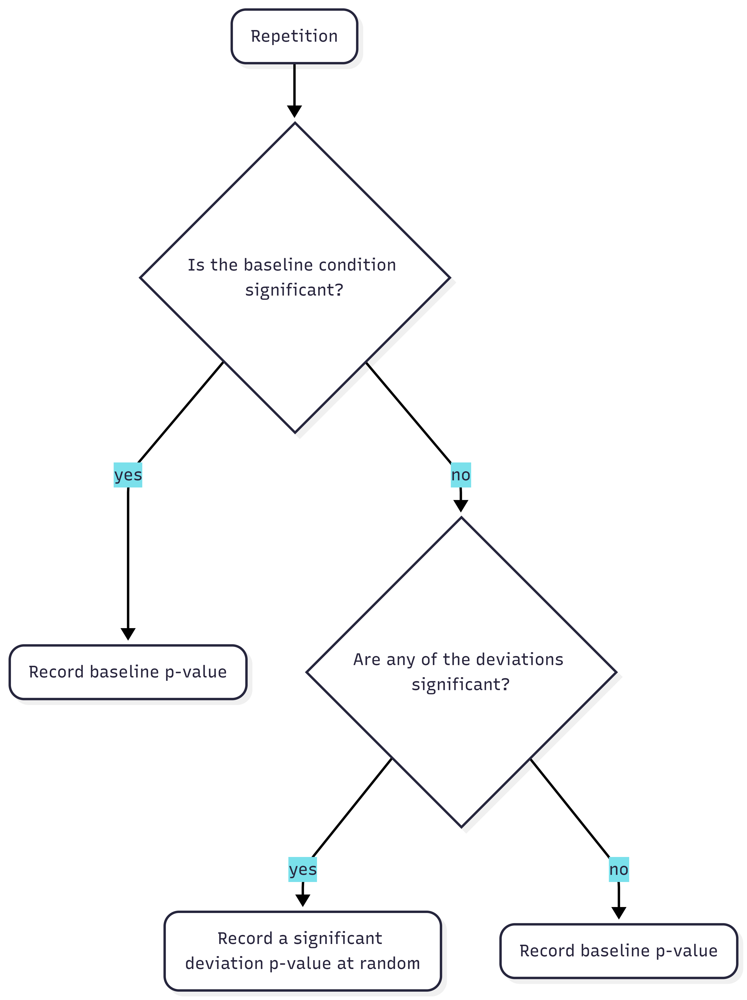
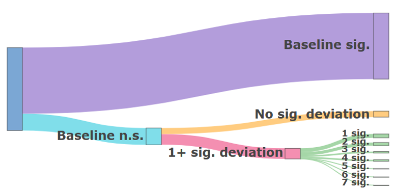

```{r}
#| label: Packages
#| echo: false
#| warning: false
#| message: false

library(tidyr)
library(ggplot2)
library(DiagrammeR)
library(dplyr)
library(thepack)
library(scales)
library(knitr)
library(kableExtra)
library(plotly)
```

The inability to reliably reproduce findings in the field of psychology is a known problem. The @opensciencecollaboration2015 found that out of 100 published studies, only 36% of significant results were replicable. One possible reason for this "replication crisis" is the exploitation of "researcher degrees of freedom" [@simmons2011]. This term describes the flexibility that researchers have in decisions made during their work, including decisions such as how many observations to collect, which statistical model to use, and which covariates to include. When these decisions are made during data collection or analysis, researchers can make opportunistic choices that steer their results towards desired outcomes. Such opportunistic choices are called *p*-hacking and can dramatically increase false-positive rates [@stefan2023].

Preregistration was proposed as a way to limit *p*-hacking and other opportunistic researcher choices. A preregistration is a document in which decisions concerning data collection and analysis are recorded prior to data collection. The document is then uploaded to a public repository, with a timestamp of when it was registered. Over 100 journals currently award Open Science Badges to recognize open practices, including preregistration [@science]. These badges signal to readers that a study's design and analysis plan were preregistered. Peer reviewers, and others, have access to the preregistration and can evaluate it before the start of the study or compare it with the final research paper. Preregistration aims to increase transparency about research choices and has become more popular, with the number of preregistrations increasing annually [@ferguson2023; @lindsay2018].

In theory, preregistration should lead to more replicable findings if researchers preregister a detailed study protocol and follow it closely [@nosek2019; @wagenmakers2012]. In practice, preregistrations are often imprecise and incomplete, making them less effective at restricting researcher degrees of freedom [@bakker2020; @claesen2021; @willroth2024]. Another common problem is deviation from preregistrations [@vandenakker2024; @claesen2021], meaning that the preregistered plan is not being followed during the execution of the study. This occurs in as much as 93% of preregistered papers [@claesen2021].

Deviations from preregistrations can occur in all aspects of the research process, from changing hypotheses to changing the number of participants collected to changing which variables are included in an analysis. These deviations could serve to diminish the effectiveness of preregistrations, as they reintroduce flexibility in researcher choices. Perhaps this is why no difference has been found between preregistered and non-preregistered papers in the number of significant findings [@vandenakker2024a], and no reduction in *p*-hacking [@brodeur2024].

## Are All Deviations Bad?

While the potential consequences of deviating from preregistrations have been widely discussed [@claesen2021; @lakens2024; @willroth2024], empirical evidence of their effects is still missing. @lakens2024 argued that deviations from original research plans do not necessarily reduce research quality. He theorized that deviations can either positively or negatively impact research quality, depending on the type of deviation and the reason for the deviation.

Oftentimes, it can be difficult to prevent deviations, especially when very specific research protocols were preregistered. Forces beyond the researcher's control may necessitate deviations from the original plan. For example, in the case of a system failure, the researcher might have no other choice but to switch platforms mid-study. If this does not affect how data is collected and analyzed, then this deviation should have little impact on the quality of results. However, if a researcher is forced to terminate data collection before the desired sample size is reached due to budgetary restrictions, this can result in an underpowered study compared to the preregistration.

On the other side of the spectrum are opportunistic deviations. Similar to *p*-hacking, researchers can examine their data and choose to stray from their preregistered research plans in order to guarantee significant results. If a researcher notes that their analysis is non-significant when using the complete set of data but significant when removing outliers, they might make the choice to deviate from their preregistration and report the significant results. This inflates the type I error rate of a study due to multiple testing as well as data-dependent selection of observations. This behavior is even more problematic if the deviation is not reported, because the reader will not be able to identify this deviation as quickly, or at all.

Between forced and opportunistic deviations lies a gray area where deviations are not forced but might instead have been reasonable choices made by the researcher. For example, if test assumptions are violated or data is no longer suitable for the preregistered analysis, then deviating from the original research plan can have positive effects on the validity of a test. Using a statistical test better suited to the data will make the results more likely to reflect the truth. However, because these decisions are made post-hoc, they still risk inflating the type I and type II error rates, as they introduce researcher degrees of freedom that are not accounted for in the preregistration and inflate $\alpha$ when multiple tests are performed. Similarly, testing a hypothesis in multiple ways can improve the robustness of a study [@neumayer2017], resulting in increased confidence in the results. On the other hand, changing the way a hypothesis is tested can also mean that a hypothesis was given less opportunity to be falsified, resulting in a higher number of false negatives. Consequently, whether a deviation is bad or not cannot be stated without knowing the type of deviation and the reason behind it. In practice, up to 89% of deviations from preregistration are incompletely reported, meaning that discrepancies between the preregistered research plan and the final study design are not communicated transparently [@claesen2021; @willroth2024]. This lack of transparency about the reasons for deviations makes it difficult for readers to assess their impact on results.

Researchers themselves consider deviations problematic to varying degrees [@willroth2024]. Changes to analyses and hypotheses are considered the least acceptable, whereas changing research platforms or software are deemed relatively justifiable. @vandenakker2024 showed that deviations occur most commonly in data collection procedures, statistical models, and exclusion criteria. In the next section, I discuss how common deviations are, how deviations theoretically impact results, and how justifiable deviations are within each domain.

## A Review of Common Deviations

### Sample Size Deviations

Deviations in sample size are some of the most common deviations, with consistency between preregistrations and published papers being only 28% for exact sample sizes [@vandenakker2024]. Lowering the sample size can inflate the type II error rate (i.e., decreasing power), whereas increasing the sample size should decrease the type II error rate [@lakens2024]. @lakens2024 further argued that the type I error rate should not be inflated by deviations in sample size, except for when the changes are chosen opportunistically. This idea is corroborated by the results from @simmons2011, who showed that *p*-hacking, in the form of opportunistically increasing the sample size, can inflate the type I error rate. Small deviations in sample size are common and may be due to factors outside of the researcher's agency, especially when collecting data online. However, in general, researchers also admit to stopping data collection earlier or continuing collection longer after finding disappointing results [@john2012].

### Outlier Exclusion Criteria Deviations

Literature shows that over half of published papers do not adhere to their pre-specified outlier exclusion criteria [@vandenakker2024; @claesen2021]. Vague or missing criteria in preregistrations make it harder to assess deviations and leave a lot of room for interpretation and ad hoc decisions [@heirene2024]. This could potentially allow researchers to choose how to exclude outliers based on which method provides better results. Researchers themselves, however, deem outlier deviations to be relatively acceptable [@willroth2024].

@lakens2024 argues that adding additional exclusion criteria can undermine the severity of a test. This idea is corroborated by @stefan2023, who showed that the type I error rate increases linearly with the number of outlier detection methods used. Furthermore, 38% of researchers in general admit to excluding outliers only after examining their impact on the data [@john2012]. Little is known about the impacts on the power of a test. However, changing how outliers are identified can change the analyzed sample size, which impacts power (see section Sample Size Deviations). Therefore, more liberal outlier exclusion methods, which exclude fewer observations from the analysis, might result in higher power.

The standard method for identifying outliers in the social sciences is the *z*-score. A minimum of 3 standard deviations (*SD*) from the mean is often maintained as the rule of thumb for excluding cases [@bakker2014; @leys2013]. Within linear regression, outliers are also often identified based on how much their exclusion would influence the regression coefficients, commonly using Cook’s distance with a value greater than 1 as a cut-off.

### Statistical Model Deviations

"Statistical Model" is a very broad domain and includes many types of deviations. In this study, "Statistical Model" refers to changes in the dependent variable, independent variable, statistical inference criteria, and the actual statistical test, not solely the statistical test and its specifications.

The breadth of the domain also means that deviations within the domain have been investigated from multiple angles. @claesen2021 found a deviation rate of 70% within the "Analysis" domain, including deviations such as examining additional effects, changing the statistical model, and performing unregistered robustness checks. The majority of these deviations went unreported. Another study reported inconsistencies in 40% of the statistical models [@vandenakker2024]. Deviations included changes to the specifications of the variables, the statistical model, and how variables were used.

At times, it might be necessary to alter the statistical model. This can happen when a variable is measured at a different level than expected or a test assumption is violated. However, changing the statistical model can also be done opportunistically. Choosing to add an extra dependent variable because results are not yet satisfying can increase the type I error rate to 9.5%, and the addition of a covariate can increase it to 11.7% [@simmons2011]. The reasoning behind the change thus becomes very important. This might also be why failing to properly specify how variables would be operationalized in the preregistration is seen as a larger shortcoming than model deviations due to unforeseen consequences [@willroth2024].

## The Current Project

In this study, the effects of typical preregistration deviations on research outcomes and the quality of published results are examined by means of a simulation study. Specifically, I answer the question: ‘How do deviations from preregistrations affect type I and type II error rates?’ The effect of deviations is studied using deviations that typically occur in preregistered papers. Different deviations are simulated in each domain and compared to nominal type I and type II error rates. Empirically examining not only the type I error rate but also the type II error rate offers a more complete account of the effects of deviating from preregistrations than currently available. Furthermore, this study should help readers of preregistered papers better assess the consequences of deviations, and how the existing literature might be impacted by deviations from preregistrations.

As a second research question, I address the issue of the reasons for deviations being unknown. Specifically: "What is the effect of deviating opportunistically on the type I and type II error rates?" As discussed, the reason behind a deviation is important for assessing its impact. A researcher being forced to deviate due to circumstance is very different from a researcher choosing to deviate. For the second research question, an 'opportunistic' condition is created in which the opportunistic selection of results by the researcher is approximated. This will provide empirical evidence on the effects of deviating opportunistically, using typical deviations from preregistrations. Knowing the impacts of deviating opportunistically will allow readers of preregistered papers to evaluate researcher choices to deviate more critically.

# Methods

To investigate the effects of deviations from preregistrations, I performed a model-based simulation study in R [@rcoreteam2024]. I reviewed which deviations to investigate by (1) how common they are, (2) their potential impact, and (3) their justifiability. Deviations were chosen in the following domains: Sample Size, Outlier Exclusion Criteria, and Statistical Model.

A baseline condition was simulated as a control condition, representing a hypothetical preregistered study. In the Sample Size Domain, four deviation conditions were simulated: the sample size was increased and decreased by 5% and 15%, as compared to the baseline condition with a sample size of 200 (@tbl-cond). In the baseline condition, observations were excluded based on a *z*-score of 3 *SD*, with deviation conditions excluding outliers based on a stricter *z*-score of 2 *SD* and Cook's distance of \> 1. Within the Statistical Model Domain, three deviation conditions were simulated: adding a continuous covariate, adding a dichotomous covariate, and switching outcomes, as compared to the baseline condition without any covariates and the preregistered outcome variable. Outcome switching refers to deviating by choosing a different, but often correlated, dependent variable than the one preregistered. In total, nine deviation conditions were simulated, as well as a baseline condition.

```{r}
#| label: tbl-cond
#| tbl-cap: "Parameter Values for Baseline Condition and Deviation Conditions per Domain"
#| apa-note: NoNote \ \emph{Note.} Variables $Y$ and $Y_a$ are defined in the next section.
#| warning: false


data <- data.frame(
  Domain = c(
    "Sample Size", "", "", "",
    "Outlier Exclusion Criteria", "",
    "Statistical Model: covariates", "",
    "Statistical Model: outcome switching"
  ),
  Baseline = c(
    "$n = 200$", "", "", "",
    "$\\vert z \\vert > 3$", "",
    "No covariates", "",
    "$Y$"
  ),
  Deviations = c(
    "+5", "+30", "-5", "-30",
    "$\\vert z \\vert > 2$", "Cook's distance $> 1$",
    "Continuous covariate", "Dichotomous covariate",
    "$Y_a$"
  )
)

kable(data, col.names = c("Domain", "Baseline Condition", "Deviation Conditions"),
      escape = FALSE, booktabs = TRUE)
```

## Data-generating Mechanism

I investigated the research questions in the context of social science and used a linear regression as the model of interest. In order to examine the effects on the type I and type II error rates, data was generated under two scenarios: "X has an effect on Y" and "X has no effect on Y". The type II error rate was investigated in the effect scenario and the type I error rate was investigated in the no-effect scenario. The only difference in data generation between the two scenarios was in the main effect parameter, $\beta_1$. In the effect scenario, $\beta_1$ was 0.2, and in the no-effect scenario, $\beta_1$ was 0. All ten conditions, one baseline condition and nine deviation conditions, were generated for both the effect and the no-effect scenario.

In the baseline condition, the statistical model was defined as $$
Y = \beta_0 + \beta_1X + \epsilon,
$$ {#eq-regr} where $Y$ is the dependent variable, $\beta_0$ the intercept, $\beta_1$ the main effect, $X$ the independent variable, and $\epsilon$ the random error.

The population parameter values are presented in @tbl-DGM, together with the parameter values for the deviation conditions. The complete data-generating model is defined as

$$
\begin{aligned}
Y &=  \beta_0 + \beta_1X + \beta_2Z + \beta_3D + \epsilon,\\
Y_a &\sim Y, \quad \rho(Y, Y_a) = 0.6, 
\end{aligned}
$$ {#eq-fullreg}

where $Z$ and $D$ represent a continuous and categorical covariate, respectively, and $Y_a$ represents an alternative outcome variable. $Y_a$ was generated with a medium to high correlation of 0.6 with variable $Y$ using the `rnorm_pre()` function from the `faux` package [@debruine2023].

To assess differences between outlier exclusion criteria, the data needed to include outliers. These were simulated by generating 5% of the data (2.5% at each end of the distribution) with -3 and 3 as mean values for the standard normal distribution from which $\epsilon$ was drawn.

Data was generated by drawing random samples from the defined population. In the baseline condition, samples of size $\it{n} = 200$ were drawn, outliers were excluded based on an absolute *z*-score greater than 3, and a simple linear regression was performed without covariates, with outcome variable $Y$. For the nine deviation conditions, the specific deviations were applied to the generated data (i.e., the sample size, outlier exclusion criterion, or statistical model was changed in accordance with @tbl-cond), after which the regression was performed.

In the simulated model, the estimand is $\beta_1,$ which represents the effect of the independent variable $X$ on the dependent variable $Y$. The coefficient was estimated using a significance test, with the `lm()` function from the `stats` package in `R` [@rcoreteam2024]. The regression was performed in all ten conditions and the $\beta_1$ regression coefficient , *p*-value, and confidence interval were recorded. Significance was assessed at $\alpha$ = 0.05. This process was repeated across 1,600 repetitions.

```{r}
#| label: tbl-DGM
#| tbl-cap: "Parameter Values for the Data-Generating Mechanism"
#| apa-note: NoNote \ \emph{Note.} $\\beta_1$ is 0 in the no-effect scenario and 0.20 in the effect scenario. The different means for $\\epsilon$ are used to generate 2.5%, 95%, and 2.5% respectively. The sample size refers to the baseline condition.
#| warning: false

data <- data.frame(
  Parameter = c(
    "Intercept",
    "Regression coefficient of interest",
    "Independent variable",
    "Random error",
    "Continuous covariate regression coefficient",
    "Continuous demographic variable",
    "Dichotomous covariate regression coefficient",
    "Dichotomous demographic variable",
    "Alternative outcome variable",
    "Sample Size"
  ),
  Value = c(
    "$\\beta_0 = 0$",
    "$\\beta_1 = 0$ or $\\beta_1 = 0.20$",
    "$X \\sim \\mathcal{N}(0, 1)$",
    "$\\epsilon \\sim \\mathcal{N}(m, 0.86)$, where $m = \\{-3, 0, 3\\}$",
    "$\\beta_2 = 0.06$",
    "$Z \\sim \\mathcal{N}(0, 1)$",
    "$\\beta_3 = 0.06$",
    "$D \\sim \\text{Bernoulli}(0.5)$",
    "$Y_a \\sim Y, \\quad \\rho(Y, Y_a) = 0.6$",
    "$200$"
  )
)

kable(data, col.names = c("Parameter", "Value"), escape = FALSE, booktabs = TRUE) 
```

## Performance Measures

Performance was assessed through the type I and type II error rates for the estimand $\beta_1$. Type I error refers to a false-positive, or rejecting the null-hypothesis when it is true. In this study that meant detecting an effect in the no-effect scenario. Type I errors are generally accepted at a rate of 5% or lower, based on an alpha level of .05 [@fisher1992]. In this case, a rate of higher than 5% was considered an inflated type I error rate.[^1]

[^1]: A more specific definition of what is considered inflated and deflated follows in Section Precision.

Type II error refers to a false negative, or failing to reject the null-hypothesis when it is false. In this study that meant failing to detect an effect in the effect scenario. Type II error is commonly assessed in the form of power. Power is $1-\beta$, where $\beta$ is the type II error. The nominal type II error rate of 20% results in a generally accepted power of 80%. In this study, type II error was expressed in the form of power, and consequently, power below 80% was considered deflated power.`\footnotemark[1]`{=latex}

### Precision

The reliability of the performance measures was assessed using precision based on the Monte-Carlo standard error (MCSE). The desired precision for power was 1%. With an MCSE of 1%, power rates were assessed at a precision interval of \[79, 81\] around the nominal power of 80%. This means that values within this interval did not show strong enough evidence of an effect and might have been caused by simulation noise. Power levels outside of this interval were considered inflated or deflated in this study.

The number of iterations was calculated based on the desired precision for the project. According to @morris2019, the required number of iterations to achieve the desired MCSE of 1% for power is 1,600 (@eq-mcsepower).

For the type I error, 1,600 iterations results in an MCSE of 0.545% (@eq-mcsetypeI). This means that the type I error rate was assessed at a precision interval of \[4.455, 5.545\] around the nominal type I error rate of 5%. Values within this interval can be due to simulation noise. Any type I error rate outside of this interval was considered a deflated or inflated type I error rate.

$$
\begin{aligned}
MCSE &= \sqrt{\frac{\widehat{\text{Power}}\left(1-\widehat{\text{Power}}\right)}{n_{\text{sim}}}},\\
0.01 &= \sqrt{\frac{\widehat{\text{0.8}}\left(1-\widehat{\text{0.8}}\right)}{n_{\text{sim}}}}, \\
n_\text{sim} &= \frac{0.8 \times 0.2}{(0.01)^2},\\
n_\text{sim} &= 1,600
\end{aligned}
$$ {#eq-mcsepower}

$$
\begin{aligned}
MCSE &= \sqrt{\frac{\widehat{\text{Type I error}}\left(1-\widehat{\text{Type I error}}\right)}{n_{\text{sim}}}},\\
MCSE &= \sqrt{\frac{\widehat{\text{0.05}}\left(1-\widehat{\text{0.05}}\right)}{1,600}}, \\
MCSE &= \sqrt{0.0000296875},\\
MCSE &\approx 0.00545
\end{aligned}
$$ {#eq-mcsetypeI}

## Study Design

To answer Research Question 1, forced deviations were investigated by simulating typical deviation conditions and deviating by default to examine their effects on the type I and type II error rates. The type I and type II error rates of each deviation condition were individually compared to the nominal type I and type II error rates.

To answer Research Question 2, the effect of deviating opportunistically was examined. This was done by creating an "Opportunistic condition", using the same data set as for Research Question 1. For each repetition, the *p-*value of the baseline condition was assessed (@fig-opp). When it was significant, the baseline condition was recorded for that repetition. If it was non-significant, the deviation conditions of that repetition were checked. If any of the deviation conditions were significant, one was chosen at random and recorded for that repetition. As a result, for each repetition, a significant result was recorded if it was available among any of the conditions. This provided an 'optimized' condition, with the maximum number of significant results possible. The error rates were then compared between the nominal levels and the opportunistic condition.

```{r}
#| label: fig-opp
#| fig-cap: Workflow for Each Repetition in the Opportunistic Condition
#| echo: false
#| out-width: "80%"



```

## Preregistration, Reproducibility and Ethics

This project was preregistered on the 31st of March, 2026. The preregistration can be found at <https://osf.io/y5v8w/overview>. During the course of this study, I deviated in two ways. A robustness check was added after inconclusive results for Research Question 1 under the Sample Size Domain. The robustness check was performed by increasing the number of repetitions from 1,600 to 10,000. Secondly, ambiguity in the preregistration was clarified. In the preregistration it was stated that the deviation conditions would be compared to the baseline condition, but also that inflated and deflated type I error rates and power would be determined based on the precision interval around the nominal levels. In the final product, deviations were compared to the nominal levels, and inflation/deflation was assessed using the preregistered interval. For further elaboration on my preregistration deviations, please consult Appendix A.

An `R` package, `thepack`, was created for this project, which includes all functions necessary to generate the data. The package is publicly available at <https://doi.org/10.5281/zenodo.20099859>. In order to advance reproducibility, all other files related to this project are also publicly available at <https://doi.org/10.5281/zenodo.20099802>, which includes data, code scripts, and output files. I used `renv` to create a reproducible environment that records package versions and the R version.

Ethics approval was obtained on October 7th, 2025, from Utrecht University, Faculty of Social Sciences, under case-number #25-1980. Generative AI tools were used in this project solely to assist with code debugging, formatting, and grammar checking. A complete AI disclosure statement is available in Appendix B.

# Results

```{r}
#| label: Generating the data
#| echo: false
#source("../Scripts/01_datageneration/datageneration.R")

#read in saved data
df <- readRDS("../Data/results.rds")

#The no-effect scenario
rq1.no <- df %>% filter(scenario == "no effect")
rq2.no <- choice(rq1.no)

#The effect scenario
rq1.yes <- df %>% filter(scenario == "effect")
rq2.yes <- choice(rq1.yes)

```

## Deviating by default

```{r}
#| label: Research question 1, effect scenario
#| echo: false

source("../Scripts/02_results/RQ1_effect.R")
```

```{r}
#| label: Research question 1, no-effect scenario
#| echo: false

source("../Scripts/02_results/RQ1_noeffect.R")
```

The primary research aim of this study was to examine the effects of deviations from preregistration on type I and type II errors. In this section the type I error rate and power of each deviation condition are compared to the nominal levels. @fig-rq1.y and @fig-rq1.n show the type I error rate and power for the baseline condition and all deviation conditions, along with the precision interval as specified in the methodology. Values outside of these intervals were considered inflated or deflated.

```{r}
#| label: fig-rq1.y
#| fig-width: 8
#| fig-height: 5
#| fig-cap: "Power for Baseline and Deviation Conditions in the Effect Scenario"
#| apa-note: NoNote \ \emph{Note.}  The red line displays the nominal power of 80%. The blue shaded area represents the precision interval around the nominal power.
#| echo: false

print(plot.1y)
```

```{r}
#| label: fig-rq1.n
#| fig-width: 8
#| fig-height: 5
#| fig-cap: "Type I Error Rate for Baseline and Deviation Scenarios in the No-effect Scenario"
#| apa-note: NoNote \ \emph{Note.} The red line displays the nominal type I error rate of 5%. The blue shaded area represents the precision interval around the nominal type I error rate.
#| echo: false
print(plot.1n)
```

### The Baseline Condition

The baseline condition was simulated as a control condition, without any deviations. It was intended to represent the simulation noise under perfect analysis conditions. Results showed a power level of `r rq1.yes.plot[rq1.yes.plot$conditions == "Baseline", "n.sig.perc"]*100`% in the baseline condition (@fig-rq1.y) and a type I error rate of `r rq1.no.plot[rq1.no.plot$conditions == "Baseline", "n.sig.perc"]*100`% (@fig-rq1.n). Both of these results fall naturally within the precision interval around the nominal $\alpha$ level.

### Sample Size Deviations

Within the Sample Size domain, the effects on power reflected what is known naturally: increasing the sample size increases power, and decreasing the sample size decreases power. These effects were also observed in the current study (@fig-rq1.y). The effects on the type I error rate were more unexpected. Three out of four Sample Size conditions showed no effect of deviating on the type I error rate (`r rq1.no.plot[rq1.no.plot$conditions == "Sample size (170)", "n.sig.perc"]*100`%, `r rq1.no.plot[rq1.no.plot$conditions == "Sample size (195)", "n.sig.perc"]*100`%, `r rq1.no.plot[rq1.no.plot$conditions == "Sample size (230)", "n.sig.perc"]*100`% for the conditions where n = 170, 195, and 230, respectively). However, small increases in sample size resulted in an inflated type I error rate of `r rq1.no.plot[rq1.no.plot$conditions == "Sample size (205)", "n.sig.perc"]*100`% (@fig-rq1.n). This is outside of the precision interval and can therefore be considered inflated.

The result, however, fell just outside of the precision interval; the type I error rate was 5.563%, with the upper bound of the precision interval being 5.545%. Considering this and the fact that none of the other sample size deviations showed similar effects, rendered this an inconclusive result. The current level of precision might have been insufficient, and I suspected that the observed result might still be due to simulation noise. In light of this, a robustness check was performed using 10,000 iterations. The observed inflation from small increases in sample size did not hold up under a larger repetition size. The results of the other sample size conditions remained unchanged.

### Outlier Exclusion Criteria Deviations

Deviations in the Outlier Exclusion Criteria domain impacted both power (@fig-rq1.y) and the type I error rate (@fig-rq1.n). Using a strict *z*-score (exclusion based on 2 *SD* instead of 3 *SD*), increased power to `r rq1.yes.plot[rq1.yes.plot$conditions == "Strict z-score", "n.sig.perc"]*100`%, and inflated the type I error rate to `r rq1.no.plot[rq1.no.plot$conditions == "Strict z-score", "n.sig.perc"]*100`%. This means that false negatives were reported less often than the nominal rate, but false positives occurred more often than the nominal rate. Using Cook's distance instead of *z*-scores deflated power to `r rq1.yes.plot[rq1.yes.plot$conditions == "Cook's distance", "n.sig.perc"]*100`% but had no effect on the type I error rate. This indicates that, when this method was used, it was less likely to observe an existing effect in the generated data.

### Statistical Model Deviations

In the Statistical Model domain, the error rates were mostly unaffected. Power was unaffected in the continuous and dichotomous covariate conditions (79.9% and 79.7%, respectively). However, a substantial deflation in power was observed in the alternative outcome condition, resulting in a power of `r rq1.yes.plot[rq1.yes.plot$conditions == "Alternative outcome", "n.sig.perc"]*100`%. No apparent effects on the type I error rate were observed in any of the conditions in the Statistical Model domain (continuous covariate = 5.4%, dichotomous covariate = 5.2%, outcome switching = 4.8%).

### Robustness check

To evaluate the inconclusive results in the Sample Size Domain at a higher level of precision, I decided to perform a robustness check. The robustness check was not preregistered but was added after encountering inconclusive results. For this simulation study that meant increasing the number of repetitions from 1,600 to 10,000. The results remained unchanged for power. For type I, the inflation in the small sample size increase condition and the strict *z*-score conditions disappeared. A small inflation in the type I error rate for the alternative outcome condition did show up, with a type I error rate of 5.3%, which could be considered inflated under the new precision interval (\[4.782, 5.218\]). For further elaboration, see Appendix C.

## Opportunistic Deviations

```{r}
#| label: Research question 2
#| echo: false

source("../Scripts/02_results/RQ2.R")
```

The second research question pertained to the effect of choosing to deviate opportunistically. This was done by comparing an opportunistic condition to the nominal type I error rate and power. In the opportunistic condition, the choice to deviate was made based on the results of the baseline condition. Whenever the baseline condition was significant, it was selected. If the baseline was non-significant, a significant deviation condition was selected instead, if available, and the number of significant deviations was recorded.

:::: {#fig-rq2.Y}
::: {layout="[65,35]"}
```{r}
#| out-width: "95%"


```

| Label                 | Count   | Percentage   |
|-----------------------|---------|--------------|
| All repetitions       | 1,600   | 100%         |
| --------------------  | ------- | ------------ |
|   Baseline sig.       | 1,279   | 79.9%        |
|   Baseline ns         | 325     | 20.3%        |
| --------------------  | ------- | ------------ |
|    No sig. deviations | 116     | 7.3%         |
|    1+ sig. deviation  | 205     | 12.8%        |
| --------------------  | ------- | ------------ |
|     1 sig.            | 75      | 4.7%         |
|     2 sig.            | 61      | 3.8%         |
|     3 sig.            | 30      | 1.9%         |
|     4 sig.            | 31      | 1.9%         |
|     5 sig.            | 4       | 0.3%         |
|     6 sig.            | 3       | 0.2%         |
|     7 sig.            | 1       | 0.1%         |
:::

```{=latex}
\noindent \textit{Note.} 'n.s.' denotes non-significance. 'Sig.' denotes significance. '1 sig.' to '7 sig.' refer to the number of significant deviation when the baseline is non-significant.
```

Distribution of Significant Conditions in the Effect Scenario, Visually (Left) and Tabular (Right).
::::

:::: {#fig-rq2.N}
::: {layout="[65,35]"}
```{r}
#| out-width: "95%"
knitr::include_graphics("../Scripts/03_visuals/bigfontN.png")
```

| Label                 | Count   | Percentage   |
|-----------------------|---------|--------------|
| All repetitions       | 1,600   | 100.0%       |
| --------------------  | ------- | ------------ |
|   Baseline sig.       | 83      | 5.2%         |
|   Baseline ns         | 1,517   | 94.8%        |
| --------------------  | ------- | ------------ |
|    No sig. deviations | 1,339   | 83.7%        |
|    1+ sig. deviation  | 178     | 11.1%        |
| --------------------  | ------- | ------------ |
|     1 sig.            | 126     | 7.9%         |
|     2 sig.            | 27      | 1.7%         |
|     3 sig.            | 17      | 1.1%         |
|     4 sig.            | 5       | 0.3%         |
|     5 sig.            | 1       | 0.1%         |
|     6 sig.            | 2       | 0.1%         |
:::

*Note.* 'n.s.' denotes non-significance. 'sig.' denotes significance. '1 sig.' to '6 sig.' refer to the number of significant deviations when the baseline is non-significant.

Distribution of Significant Conditions in the No-Effect Scenario, Visually (Left) and Tabular (Right).
::::

### Effects on Power

Choosing to deviate had a positive effect on power. In 1,484 out of 1,600 repetitions, at least one significant condition was observed among the baseline condition and the deviation conditions. This resulted in a power of `r (rq2.yes.nsig.perc*100)`%. In total, `r round((rq2.yes %>% filter(n.sig == "NA") %>% nrow())/1600*100, 1)`% of the repetitions resulted in a significant baseline (@fig-rq2.Y). Of the `r 1600 - rq2.yes %>% filter(n.sig == "NA") %>% nrow()` repetitions in which the baseline was non-significant, `r round((rq2.yes %>% filter(n.sig == "0") %>% nrow())/321*100, 1)`% also reported no significant deviation. The remaining 64% of repetitions, in which the baseline was non-significant, had at least one significant deviation. The highest number of significant deviation conditions was seven out of nine.

### Effects on Type I Error

The majority (`r round((rq2.no %>% filter(n.sig == "0") %>% nrow())/1600*100, 1)`%) of the repetitions showed a non-significant baseline as well as non-significant deviations (@fig-rq2.N). Significant baseline conditions were observed `r round((rq2.no %>% filter(n.sig == "NA") %>% nrow())/1600*100, 1)`% of the time, which fell within the precision interval around the nominal $\alpha$ level of 5%. Of the repetitions with a non-significant baseline, 12.8% showed at least one significant deviation. Combining the significant baseline conditions and significant deviation conditions inflated the type I error rate to `r rq2.no.perc*100`%.

### Robustness check

Increasing the repetition size to 10,000 did not change the conclusions for Research Question 2. The type I error rate was 15.4%, and the power was 92.3%.

# Discussion

The goal of this simulation study was to investigate the effects of deviations on research outcomes and the quality of published results. Deviating from preregistration plans happens very commonly [@vandenakker2024; @claesen2021], but the consequences of doing so were unclear. To investigate these effects, I identified three domains in which deviations commonly occur: Sample Size, Outlier Exclusion Criteria, and the Statistical Model. Within those domains I identified nine deviation conditions (see @tbl-cond). These deviations were then examined in terms of their effects on type I and type II error, and compared to the nominally accepted rates.

The results from Research Question 1 show that both the type I and type II error rates are affected when researchers are forced to deviate from a preregistration. Negative impacts on type I and/or type II error rates can occur when researchers are forced to deviate by 1) strongly decreasing the sample size, 2) using Cook's distance as outlier criterion (as opposed to a *z*-score of 3 *SD*), 3) switching to an alternative outcome that is moderately to strongly correlated with the original outcome variable, and 4) using a stricter *z-*score as outlier criterion (2 *SD* instead of 3 *SD*). These four types of deviations appear to be most consequential as they can either deflate power or inflate the type I error rate. All inflations of the type I error rate were relatively small (the highest type I error rate being 5.8%), and did not hold up under the robustness check. This indicates that forced deviations pose little risk to the type I error rate. The strongest impact on power was caused by switching outcomes, with a steep drop off from the nominal 80% to 35.2% power. Positive effects on power were also observed, when the sample size was substantially increased and when a strict *z*-score was used to identify outliers. There were no conditions in which the type I error rate was decreased.

These results show that deviating is not inherently bad. Deviating by default can have negative or positive effects, depending on the deviation and whether there is an effect to be detected. In reality, researchers are unaware of whether they are facing an effect or no-effect scenario. As a result, the researcher cannot predict whether their deviation will hurt their type I or type II error. For example, changing the threshold for excluding outliers from 3 *SD* to 2 *SD* was shown to increase power but also inflate the type I error rate. Because the researcher does not know which scenario they are facing, the deviation is best avoided in order to prevent an inflated type I error rate in the case of a no-effect scenario. Some deviations are impossible to avoid, but the results of Research Question 1 show that their inflation of the type I error rate is limited. Deflating power is mainly a concern when forced to deviate by switching outcomes, but not for other forced deviations.

The type I error rate and power were more severely affected by deviating opportunistically. In Research Question 2, the effects of choosing to deviate in order to achieve significant results were investigated. Power increased to 92.7% in the effect scenario. This result is unsurprising, as the condition was designed to maximize the number of significant results. The total type I error rate for this condition was 16.3%. When the baseline scenario was non-significant, a significant deviation result was still found 12.8% of the time. This means that when researchers look at their outcomes and find non-significant results, choosing to deviate can still result in significant findings 1 out of 8 times. Knowing why a researcher deviated and whether they did so based on their initial results is therefore necessary to elucidate the true harm of a deviation.

## Implications for Existing Preregistered Literature

It is difficult to draw conclusions about what this means for the literature. If we are dealing with a best-case scenario, then all deviations are due to factors outside of the researchers' control and the error rates in published preregistered literature are relatively unimpacted by deviations. The type I error rate in preregistered papers might be slightly inflated, but not alarmingly so. Based on the results of my simulation study, the only type of deviation that is cause for concern is when researchers deviate by switching to an alternative outcome. This deviation substantially reduces power, and as a consequence, when significant results are reported with this type of deviation, they are less likely to be due to a true effect. When power is low, true results are detected less often, meaning that false positives make up a larger portion of significant effects because fewer true positives are available to offset them.

In a worst-case scenario, all deviations stem from malicious intent and were chosen opportunistically to achieve significant results. In that case, preregistered papers would have a false positive rate well above the nominal 5%, reaching at least 16.3%. In this simulation study, deviating was limited to singular deviations, meaning that only one deviation was made at a time. In reality, researchers might choose to deviate in multiple ways simultaneously. Especially when deviations are made opportunistically, it is quite plausible that researchers would try more than one method at once to obtain significant results. Combining multiple deviation methods likely results in even higher type I error rates. @simmons2011 showed this in their study on *p*-hacking, where combining *p*-hacking methods resulted in higher type I error rates than applying individual methods. Similarly, @stefan2023 showed that combining multiple outlier detection methods increased the type I error more than using only one method. Therefore, this estimate is extremely conservative and serves as a lower bound for the type I error rate, which in reality might be much higher than 16.3%.

In reality, we likely fall somewhere in between the best and worst-case scenarios. In the introduction for each deviation domain, I discussed the rates at which general researchers used questionable research practices, as reported by @simmons2011. Whether these rates at which opportunistic choices are made are similar for registered papers is unknown, but unlikely. The goal of preregistration is to limit researcher degrees of freedom, and the increased accountability of a public preregistration likely discourages researchers from making opportunistic choices. The problem is that the reasons for deviations remain unknown, making it difficult to determine what portion of deviations reflects deliberate researcher choices or necessary adjustments. This makes it difficult to assess the impact of deviations on the error rates in published preregistered research.

## Limitations

In addition to the fact that deviations were investigated individually and not factorially, it is important to note that the data simulated in this study was based on a data-generating mechanism and deviation conditions tailored to social sciences. This is likely to make the results less generalizable to other disciplines in which the currently used data structure is less common. The baseline sample size, effect size, and methods are common across the social sciences but might look very different in other quantitative disciplines such as medicine or economics. A natural extension of the project would be to examine whether the found effects would hold up under different sample or effect sizes. Therefore, future research might explore whether these results persist under alternative data-generating mechanisms.

It might similarly be interesting to examine the effects of a wider berth of deviations. Within this study, deviations were limited to three domains and nine deviations. In reality, there are many more [@vandenakker2024; @claesen2021; @heirene2024]. The deviations in this study were chosen because they were deemed common, impactful or disapproved of. Deviations in hypotheses were considered outside of the scope of this study, as it required a different data structure. However, deviations in hypotheses are very common and could potentially have a large impact on the type I error rate and power [@vandenakker2023]. This means that the effects in this study are likely to be an underestimate of actual deviation impacts.

As a result of limited deviations being tested and the fact that these were all tested individually, the actual impact of deviations and the true type I error rate in preregistered papers might be severely underestimated. Further research into this topic might explore a factorial version of this simulation study to examine these effects.

## Recommendations

Based on the results and the existing literature, I propose three recommendations for researchers dealing with deviations and preregistrations:

1.  **Consider the consequences before deviating.** What the results showed most strongly is that choosing to deviate based on non-significant results is the most harmful. Deviating this way can greatly increase the chances of finding false positive results and undermines the reliability of the findings. Ironically, in this study I do something similar. Based on the inconsistent finding that only a small increase in sample size inflates the type I error rate among sample size deviations, I executed a robustness check. This illustrates the fact that choosing to deviate is a trade-off. Adding a robustness check, or other reliability measures, should in and of itself not harm type I and type II errors. At the same time, basing these decisions on the data makes it more likely to find false positive results. What is essential is that researchers consider the possible impacts of a deviation before doing so. The results of this study should help researchers assess the risk they are taking when they deviate. The most important thing is transparency; report all results and deviations openly and honestly, making clear which results stem from preregistered analyses and which are based on deviations.

2.  **Report your reason for deviating.** Deviations are at times unavoidable; in those cases it is important that they are dealt with properly. As of yet, researchers often fail to report their reasons for deviating [@claesen2021; @willroth2024]. This is a big issue considering that the results of this study show that choosing to deviate opportunistically leads to a much larger inflation in the type I error rate than forced deviations. There has been a call to report deviations from preregistrations for a while now [@claesen2021; @heirene2024; @willroth2024]. I suggest going one step further and mandating that the reasons for deviations are reported as well. @willroth2024, and @lakens2024 have compiled overviews of the different reasons for deviating, as well as suggestions on how to interpret the possible effects of deviating. A standardized template for reporting preregistration deviations was proposed by @willroth2024, including the 'type', 'reason', and 'timing' of the deviation. When researchers properly document how they deviate and why they deviate, readers can draw their own conclusions about the validity of the results. Documenting the timing of the deviation makes it easier to assess whether deviations were made ad-hoc. If deviations were indeed made after viewing the results, readers should be even more critical of the reason for the deviation and consider the fact that false positives are much more likely. I recommend that this type of reporting becomes the standard among preregistered papers, and that a complete and transparent report on deviations and their reasons becomes a requirement for obtaining the 'Preregistered' Open Science Badge.

3.  **Think critically about why researchers deviate.** For readers evaluating preregistered papers, I recommend evaluating the reasons for deviating critically. This is simpler when the reason for the deviation has been reported using the previously mentioned deviation template. When evaluating the deviation, I recommend looking at both the timing and the reason. Assessing the timing of the deviation allows you to look at whether the deviation was made after results were known. If deviations were made before data collection, they are likely to be less harmful than when made after data was collected or results were known. This is exemplified in this study by the fact that a much higher type I error rate was observed when picking deviations opportunistically (16.3%) than compared to any forced singular deviation condition (`r (max(rq1.no.plot$n.sig.perc))*100`%). If researcher deviated after looking at the results, then readers of the study should be more critical of the reason for the deviation. In general, the reason behind a deviation should be assessed carefully. When deviations were not transparently reported, the reader can still make inferences about the necessity of the deviation. For example, using a stricter *z*-score resulted in an inflated type I error rate, but what could motivate a researcher to change their outlier criteria in the first place? There are very few scenarios in which a researcher would be forced to switch outlier criteria. If the researcher changed the outlier criteria but failed to report the reason and the original results, this should raise the reader's eyebrows. As of yet, reasons for deviating are rarely reported transparently. It is therefore important that the readers of preregistered papers evaluate deviations critically.

## Conclusion

Deviating from a preregistered research plan is not inherently bad. It can improve or harm the quality of research, depending on the type of deviation and the reason for deviating. Being forced to deviate can deflate power and inflate the type I error rate, but this is hard to prevent due to the uncontrollable nature of the deviation. Choosing to deviate in order to get better results shows a large impact on the number of false positives and is highly problematic.

The goal of preregistration is to limit researcher degrees of freedom and improve the reliability of research. To what extent these goals are achieved cannot be determined as long as the reasons for deviating are not transparently reported. Reporting the reasons for deviating will not solve the issue of opportunistic research choices, but it will allow critical evaluation of deviations more easily. Therefore, I recommend that researchers register the reasons for deviating from their preregistration, because deviations are not inherently bad, but they do have the potential to be harmful.

\newpage

# References

# Preregistration deviations {.appendix}

\begin{sidewaystable}[h]
\caption[Preregistration Deviations and Unregistered Steps, Using the Template by Willroth et al. (2024).]{Preregistration Deviations and Unregistered Steps, Using the Template by Willroth et al. (2024).\label{tbl-personaldeviations}}
\begin{adjustbox}{width=\textheight, center}
\scriptsize
\begin{tabular}{|p{1cm}|p{4cm}|p{4cm}|p{4cm}|p{6cm}|}

% --- Deviations section ---
\hline
\multicolumn{5}{|l|}{\textbf{Deviations}} \\
\hline
\multicolumn{1}{|c|}{\textbf{No.}} &
\multicolumn{1}{c|}{\textbf{Details}} &
\multicolumn{1}{c|}{\textbf{Original wording}} &
\multicolumn{1}{c|}{\textbf{Deviation description}} &
\multicolumn{1}{c|}{\textbf{Reader impact}} \\
\hline
1 &
Type: Comparison criteria \newline 
Reason: Ambiguity in the preregistration \newline 
Timing: After results were known &
"The baseline condition will be compared to each of the outputs from the deviation conditions...A 1\% MCSE rate means that a power level below 79\% is considered deflated and above 81\% is considered inflated. ... For the type I error a 1\% MCSE means that a false positive rate of lower than 4.455\% is considered deflated and above 5.545\% is considered inflated." &
Each deviation condition was compared to the nominal type I error rate and power levels using the preregistered precision interval instead of the baseline condition. The baseline condition served as a control condition, reflecting simulation noise under perfect analysis conditions. &
This is unlikely to have impacted results. The cut-off values for what would be considered inflated/deflated error rates were preregistered very clearly and adhered to. The deviation mainly served to clarify the purpose of the baseline condition as a control condition rather than a comparison. Adhering to the original comparison by comparing deviation conditions to the baseline condition would not have changed the results because 1) the baseline condition closely reflected the nominal error rates, and 2) no cut-off values were preregistered for comparisons to the baseline and a meaningful comparison thus could not have been made. \\

% --- Unregistered steps section ---
\hline
\multicolumn{5}{|l|}{\textbf{Unregistered steps}} \\
\hline
\multicolumn{1}{|c|}{\textbf{No.}} &
\multicolumn{1}{c|}{\textbf{Details}} &
\multicolumn{1}{c|}{\textbf{Original wording}} &
\multicolumn{1}{c|}{\textbf{Unregistered step description}} &
\multicolumn{1}{c|}{\textbf{Reader impact}} \\
\hline
1 &
Type: Robustness analysis \newline 
Reason: Inconclusive results in the Sample Size Domain in the no-effect scenario \newline 
Timing: After results were known &
"The number of simulations per condition is 1600" &
An additional robustness analysis was performed with 10,000 iterations &
The fact that this step was added based on results, increases the likelihood of type I error due to multiple testing. Similarly, deeming the results of the Sample Size Domain inconclusive was a subjective decision. However, this analysis was not added out of a desire for specific results, considering the fact that no hypotheses were formalized. Since the precision of the analysis was increased by the addition of the robustness analysis, the reliability of the conclusions was likely improved. \\
\hline

\end{tabular}
\end{adjustbox}
\end{sidewaystable}

# AI Statement {.appendix}

{height="87%"}

# Robustness figures {.appendix}

```{r}
#| label: Generating the data with 10,000 repetitions
#| echo: false
#source("../Scripts/01_datageneration/datageneration_robust.R")

#read in saved data
df <- readRDS("../Data/bigresults.rds")

#Create data set with only the no-effect scenario
rq1.no <- df %>% filter(scenario == "no effect")
#run choice analysis on each iteration
rq2.no <- choice(rq1.no)

#Create data set with only the effect scenario
rq1.yes <- df %>% filter(scenario == "effect")
#run choice analysis on each iteration
rq2.yes <- choice(rq1.yes)

```

```{r}
#| label: Robust, research question 1
#| echo: false

source("../Scripts/02_results/RQ1_robust.R")
```

```{r}
#| label: fig-robustY
#| fig-cap: Power per Condition across 10,000 Repetitions
#| echo: false
#| apa-note: NoNote \ \emph{Note.} The red line displays the nominal power of 80%. The blue shaded area represents the precision interval around the nominal power. Increasing number of repetitions narrowed the precision interval to [79.6, 80.4].

print(bigplot.1y)
```

```{r}
#| label: fig-robustN
#| fig-cap: Type I Error Rate per Condition across 10,000 Repetitions
#| echo: false
#| apa-note: NoNote \ \emph{Note.}  The red line displays the nominal power of 80%. The blue shaded area represents the precision interval around the nominal power. Increasing number of repetitions narrowed the precision interval to [4.782, 5.218].

print(bigplot.1n)
```

```{r}
#| label: Robust, research question 2
#| echo: false

source("../Scripts/02_results/RQ2_robust.R")
```
