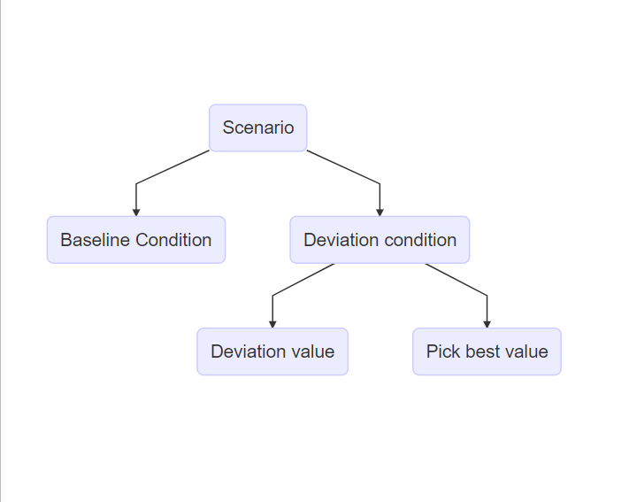

<!-- WHEN YOU WANT TO RUN THE CODE, REMOVE EVAL: FALSE FROM YAML -->

<!-- I wanted to outsource the packages script but then it has some mirroring issue -->

```{r}
#| label: Packages
#| echo: false
#| warning: false
#| message: false

library(dplyr)
library(tidyr)
library(ggplot2)
library(DiagrammeR)
library(mvtnorm)
library(stats)
```

## Introduction

Preregistrations were popularized in the 2010s in psychology as a way to increase reproducibility [@lindsay]. Preregistrations are documents that are published at the start of the research process, in which decisions concerning data collection and analysis are recorded. This is done with the aim to limit the amount of choices a researcher can make during their project, thereby limiting how much can be steered towards desired results.

This method of increased transparency about research choices has become more popular over the years with the number of preregistrations increasing yearly [@ferguson2023; @lindsay2018]. However, whether the desired effect of limiting flexibility and improving reproducibility has been achieved is debated. It is often argued that preregistrations should lead to more credible anad reproducible results [@wagenmakers2012a; @lakensb; @nosek2018a]. However, research has also shown no difference between preregistered and non-preregistered papers in the number of significant findings [@vandenakker2024b], nor a reduction in p-hacking [@brodeur_preregistration_2024].

There are many reasons for the uncertainty of the effect. Preregistrations are often incomplete or unspecific about their decisions [@heirene_preregistration_2024; @claesen2021]. Furthermore, researchers also deviate from their predetermined choices quite often [@vandenakker2024a; @claesen2021]. Deviations have been found in as high as 93% of preregistered papers, with as much as 63% going unreported [@claesen2021; @willroth2024]. This can potentially cause a large problem. Because, what we do not know is 'what is the effect of deviations from preregistrations?'.

The aim of this project is to identify problematic deviations and investigate their effects. I first go into more depth about the goals and problems of preregistrations and the potential impact of deviations. Then, through a simulation study I examine the effect of said deviations on the type I and type II error rates in research.

### The Problem and the Solution

The inability to reliably reproduce findings in the field of psychology is a known problem. In 2015, @opensciencecollaboration2015 showed that only 36% of significant results could be reproduced. One reason for this replication crisis is 'researcher degrees of freedom' [@simmons2011]. This term describes the flexibility that researchers have in decisions made during their work. This includes decisions such as how many participants to collect, which statistical model to use and which covariates to add. When these decisions are made during data collection or analysis, researchers can make opportunistic choices to steer their results towards the desired outcome. This action is called 'p-hacking' and can dramatically increase false-positive rates of research [@stefan2023].

In order to limit these types of practices, preregistrations (amongst other solutions) were proposed. Templates are available to researchers, specifying which information is important to preregister, depending on the type of research. The preregistration is then uploaded to a public repository with a time stamp of when it was published. Peer reviewers, and others, have access to the preregistration and evaluate it before the start of the study or compare it to the final research paper. In theory preregistrations work well, if researchers are specific in their preregistrations and follow them closely, this should lead to better reproducible findings. In practice, this happens differently. Preregistrations are often imprecise and incomplete, meaning that the goal of limitating flexibility is diminished. Furthermore, deviations from preregistrations also happen commonly [@vandenakker2024a; @claesen2021]. Meaning that during the actual research, predetermined plans are not being followed. Changes between preregistrations and final publications occur most commonly in data collection procedures, statistical models and exclusion criteria [@vandenakker2024a]. This includes discrepancies in the total sample size, how outliers are selected and which covariates are used. This could serve to further diminish the effectiveness of preregistrations, as it reintroduces researcher degrees of freedom and leaves room to revert back to p-hacking strategies.

### Are all deviations bad?

Deviations from preregistrations occur in all different aspects of the research process, but what is not known is the effect of these deviations. Do these changes from original research plans negatively impact the quality of the research? @lakens_when_2024 theorized what the possible consequences could be. He argues that if deviations occur due to assumptions being violated or data no longer being suitable for the planned analysis, then deviating from the original research plan can have positive effects on the validity of a test. Similarly, adding additional analyses can increase the robustness. On the other hand, changes in testing also mean that a test is generally less "severely" tested. Meaning that a theory has not been given the proper opportunity to be falsified which can result in higher type II errors. Consequently, little can be said about whether deviations are bad, especially when the reason for the deviation is unknown.

When evaluating whether inconsistencies between preregistrations and final publications are problematic, researchers themselves are also uncertain. When asked by @willroth2024, researchers deemed certain deviations to be more problematic than others. No deviation is considered to be very acceptable but changes to analyses and hypotheses are deemed least acceptable, whereas changing the research platform or using different software might be justifiable. These judgements were based not only on the type of deviation but also on whether the deviation was reported transparently and what the estimated impact on the results of the study was. However, as mentioned, assessing the impact of these deviations remains difficult.

<!-- summarize what is know before introducting own project. what is still missing is formal analysis of the effects -->

### This project

<!-- THe presetn project -->

With this simulation study, I intend to close this gap in the literature and explore the effects of typical preregistration deviations on research outcomes and the quality of published results. Specifically, I aim to answer the question: ‘How do deviations from preregistrations affect Type I and Type II error rates in research?’. The effect of deviations is studied in three domains: sample size, outlier identification, and the statistical model. Different deviations are simulated in each of these domains and compared to a baseline condition with no deviations. This research question is investigated in the context of behavioral psychology and uses linear regression as the main model of interest. The effects are examined across two scenarios: a no-effect scenario, and an effect scenario. The aim of this study is descriptive and therefore no specific hypotheses are formalized.

As a potential secondary goal, I hope to address the issue of reasons for deviations being unknown. The reason behind a deviation is important for assessing its effect. A researcher being forced to deviate due to circumstance is very different from a researcher *choosing* to deviate. When a researcher chooses to deviate, this could be because they are picking the result that they like best. In order to assess the effect of choice on the effect of deviations each deviation condition is simulated twice. Initially, the deviation conditions are simulated and the outcomes are used to assess type I and type II error. In the second phase, deviations are simulated but the outcomes are then compared to the baseline condition. Results are chosen from either the baseline or the deviation condition, based on which condition has the better value, to proxy the opportunistic selection of results by the researcher.

With these simulations I hope to provide clarity on the effect of deviations from preregistration on type I and type II errors, as well as the effect of picking deviations opportunistically.

## Methods

### Aims

The aim of this simulation study is to investigate the impact of making changes to preregistered analysis plans on the type I and type II error rates.

### Conditions

I reviewed which deviations to investigate by (1) how often they occur, (2) their potential impact and (3) their justifiability. Based on this I chose deviations in the following domains: sample size, outlier identification, and statistical model. Another important domain in which deviations occur is in the hypotheses. Deviations in the hypotheses often include adding an additional hypothesis, removing hypotheses or changing the direction of the hypothesis [@akkerhypothesis]. Most of those deviations occur at the paper level, as they involve multiple hypotheses or altering the type of testing involved. This project examines deviations on the hypothesis level, where the determinant is kept constant. As such, deviations in the hypothesis domain are not included in this study but remain an important aspect of preregistration deviation. Within the three chosen domains, multiple conditions are simulated and compared to a baseline condition without any deviations.

#### Sample size

Deviations in the sampling size are some of the most common deviations, with consistency between preregistrations and published papers only being 28% for the exact sampling size [@vandenakker2024]. Changing the sample size can decrease power in research as well as inflate the false-positive rates [@lakens; @simmons2011]. Small deviations in sample size are common and often due to oversights during the collection process. Researchers also admit to stopping collection earlier or continuing collection longer after finding disappointing results [@john], however, whether this is also used as a reason to deviate from preregistrations is unknown. Based on this, the conditions in @tbl-conditions are simulated within the sample size domain.

#### Outlier identification

Literature shows that over half of published papers do not adhere to their own specified outlier criteria [@vandenakker2024a; @claesen2021]. Reasons for these deviations often include vague criteria in the preregistration or failing to specify outlier criteria at all in preregistrations. When criteria are specified, they often leave a lot of room for interpretation and ad hoc decisions [@heirene_preregistration_2024]. This could potentially lead to researchers choosing how to exclude outliers based on which method provides better results. However, @bakker2014 showed that there is no significant difference in the amount of significant findings between papers with outlier exclusion and those without. This suggests that adding outlier exclusion criteria when they were not specified in the preregistration might not be a problem. Researchers also deem outlier deviations to be relatively acceptable [@willroth2024].

However, @lakens argues that adding additional exclusion criteria can undermine the severity of a test. This idea is corroborated by @simmons2011, who showed that the Type I error increases linearly with the number of outlier methods used. Furthermore, 38% of researchers admit to excluding outliers only after examining their impact on the data [@john]. If this is also the reason why many people deviate from their preregistered outlier criteria, then these deviations could be impactful. Consequently, whilst deviations in outlier identification are common and relatively accepted, they might have quite an effect.

The most common method for excluding outliers in the social sciences is the z-score. A minimum of three standard deviations from the mean is often maintained as the rule of thumb for excluding cases. Within linear regression, it is also common to exclude outliers based on their influence. One of the more commonly used methods is Cook's distance. Cook's distance excludes outliers based on how much the exclusion would influence the regression coefficients. In this study, the baseline condition will be to not exclude any datapoints, with deviation conditions based on z-score and Cook's distance @tbl-conditions.

#### Statistical model

Amongst all of the aforementioned domains, the least is known about why people deviate from their preregistered statistical model. 'Statistical model' is a very broad domain and includes many types of deviations. Such as, changes in the dependent variable, independent variable, statistical inference criteria and the actual model which is assessed. In this paper 'statistical model' refers to all the abovementioned types of changes, not only the statistical test and its specifications.

The broadness of the domain also means that deviations within the domain have been investigated from multiple angles. @claesen2021 shows a deviation rate of 70% within the 'analysis' domain, including deviations like examining additional effects, changing which model is tested and performing unregistered robustness checks. The majority of these deviations went unreported. @vandenakker2024a also shows inconsistencies in 40% of the statistical models. In that research, deviations included the specifications of the variables, which model was tested and how variables were used.

As @lakens argues, at times it might be necessary to alter the statistical model used. For example, when a variable has been measured at a different level than expected or a test assumption has been violated. However, changing the statistical model can also be done opportunistically. Choosing to add an extra dependent variable because results are not yet satisfying can increase the type I error rate to 9.5%, and the addition of a covariate can increase it to 11.7% [@simmons2011]. The reasoning behind the change thus becomes very important. Therefore, deviations due to failing to properly specify how variables would be operationalized in the preregistration are also seen as a larger shortcoming than model deviations due to unforeseen consequences [@willroth2024]. Within the statistical model, three deviation conditions are simulated; outcome switching, adding a continuous covariate, and adding a dichotomous covariate (@tbl-conditions.)

<!-- reasons to compare only nested models perhaps to maintain same estimands and performance measures  -->

| Domain                 | Simulation Condition           |
|------------------------|--------------------------------|
| Baseline               | No deviations                  |
| Sample Size            | +5 participants                |
|                        | +30 participants               |
|                        | -5 participants                |
|                        | -30 participants               |
| Outlier Identification | Z-score \>                     |
|                        | Cook's distance \>1            |
| Statistical Model      | Outcome switching              |
|                        | Adding a continuous covariate  |
|                        | Adding a dichotomous covariate |

: Deviation Domains and Corresponding Deviation Conditions {#tbl-conditions}

### Data-generating mechanism

<!-- talk about hypothesis in terms of effect no effect -->

Data is generated under two scenarios; the hypothesis is true and the hypothesis is not true. The hypothesis is as follows: 'X has an effect on Y'. Both scenarios generate data by producing parametric draws from a linear regression model. $$
Y = \beta_0 + \beta_1X + \epsilon
$$. In which $y$ is the dependent variable, $beta_0$ the intercept, $beta_1$ the main effect, and $\epsilon$ the random error. Therefore the one difference in data generation between the two scenarios is in the $\beta_1$ parameter. In the $H = true$ scenario, $\beta_1$ is 0.3, and in the $H = false$ scenario, $\beta_1$ will be 0. In order to asses differences between outlier identification methods, the data need to include outliers. In order to simulate outliers, 5% of the data is simulated with an increased or decreased value for $\epsilon$. The parameter values for the data generating mechanism are specified in @tbl-DGM.

| Parameter | Value |
|-------------------------------|-----------------------------------------|
| Intercept | $\beta_0 = 0$ |
| Regression coefficient | $\beta_1 = 0$ or $\beta_1 = 0.30$ |
| Independent variable | $X \sim \mathcal{N}(\mu, \sigma^2)$ |
| Random error | $95\% = \epsilon \sim \mathcal{N}(0, 1)$ |
|  | $2.5\% = \epsilon \sim \mathcal{N}(-2, 1)$\* |
|  | $2.5\% = \epsilon \sim \mathcal{N}(2, 1)$\* |
| Continuous covariate regression coefficient | $\beta_2 = 0.10$ |
| Continuous demographic variable | $Z \sim \mathcal{N}(\mu, \sigma^2)$ |
| Dichotomous covariate regression coefficient | $\beta_3 = 0.10$ |
| Dichotomous demographic variable | $D \sim \text{Bernoulli}(0.5)$ |
| Sample size | $200$ |

\*Specific value of epsilon for outliers is to be determined

:   Data generating mechanism {#tbl-DGM}

### Estimands

The estimand of this study is $\beta_1,$ which represents the effect of the independent variable.

### Methods

As previously mentioned, there are two scenarios under which data is generated. A no-effect scenario, in which the hypothesis is false and an effect scenario, in which the hypothesis is true. Within these scenarios each simulation is examined under different conditions. The conditions include a baseline condition, with no deviations, and one condition for each possible deviation (#tbl-cond)

| Domain           | Baseline condition | Deviations conditions    |
|------------------|--------------------|--------------------------|
| Sample size      | 200                | +5                       |
|                  |                    | +30                      |
|                  |                    | -5                       |
|                  |                    | -30                      |
| Outliers         | No outliers        | Based on Z-scores        |
|                  |                    | Based on Cook's distance |
| Covariates       | No covariates      | Continuous covariate     |
|                  |                    | Dichotomous covariate    |
| Outcome variable | Y                  | Ya                       |

: Parameter Values for Baseline and Deviation Conditions {#tbl-cond}

*If time allows*, After examining the effects per condition, the effect of choosing whether or not to deviate is examined. This is done by simulating each deviation condition as reported in #tbl-cond, but instead of automatically examining the value of the deviation condition, a choice is made. In each iteration the p-value of the deviation condition is compared to the p-value of the baseline condition, the most desired p-value is added reported as the outcome. An overview can be found in Figure @fig:process-phases.



### Performance measures

Performance is assessed through the Type I and Type II error for the estimand $\beta_1.$ Specifically, the regression coefficient itself, the p-value and the confidence interval are collected for each condition in each iteration.

The type I error refers to a false-positive, or rejecting the null-hypothesis when it is true. In this study that would mean detecting an effect in the no-effect scenario. Type I error is generally acceptable at a rate of 5% or below, based on an alpha level of 0.05. In this case, a rate of higher than 5% is considered an inflated type I error rate.

Type II error refers to a false negative, or failing to reject the null-hypothesis when it is false. In this study that would mean failing to detect an effect in the effect scenario. Type II error is commonly assessed in the form of power. Power is $1-\beta$, where $\beta$ is the type II error. The nominal type II error rate of 0.20 results in a generally accepted power level of 80%. Consequently, in this study, power rates of below 80% are considered an inflated type II error rate.

<!-- ## Results -->

<!-- -   include what I expect results to look like -->

<!-- ## Discussion -->

<!-- -   limitation of specific field -->

<!-- -   what does this research say about the field and what has been published till now -->

<!-- -   how do we keep the field reliable? which deviations should we try to avoid and which ones do not seem to matter much? -->

<!-- -   hypotheses so many deviations, could be concern but outside of this scope -->

<!-- ## Conclusion -->

\newpage

## References
