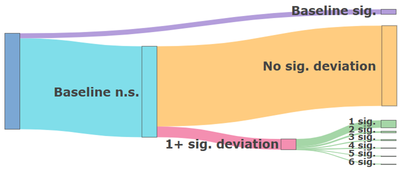

```{r}
#| label: Packages
#| echo: false
#| warning: false
#| message: false

library(tidyr)
library(ggplot2)
library(DiagrammeR)
library(dplyr)
library(thepack)
library(scales)
library(knitr)
library(kableExtra)
library(plotly)
```

The inability to reliably reproduce findings in the field of psychology is a known problem. The @opensciencecollaboration2015 found that out of 100 published studies, only 36% of significant results were replicable. One possible reason for this "replication crisis" is the exploitation of "researcher degrees of freedom" [@simmons2011]. This term describes the flexibility that researchers have in decisions made during their work, including decisions such as how many observations to collect, which statistical model to use, and which covariates to add. When these decisions are made during data collection or analysis, researchers can make opportunistic choices which steer their results towards desired outcomes. Such opportunistic choices are called *p*-hacking and can dramatically increase false-positive rates [@stefan2023].

Preregistration was proposed as a way to limit *p*-hacking and other opportunistic researcher choices. A preregistration is a document in which decisions concerning data collection and analysis are recorded. The document is then uploaded to a public repository, with a time stamp of when it was registered. Peer reviewers, and others, have access to the preregistration and can evaluate it before the start of the study or compare it to the final research paper. Preregistration aims to increase transparency about research choices and has become more popular, with the number of preregistrations increasing annually [@ferguson2023; @lindsay2018].

In theory, preregistration should lead to more replicable findings if researchers preregister a detailed study protocol and follow it closely [SOURCE]. In practice, preregistrations are often imprecise and incomplete, making them less effective at restricting researcher degrees of freedom [SOURCE]. Another common problem is deviation from preregistrations [@vandenakker2024; @claesen2021]. Deviating means that the preregistered plan is not being followed during the execution of the study. @claesen2021 found deviations in as much as 93% of preregistered papers. Furthermore, when deviations occur, they are rarely reported transparently. Up to 89% of deviations are incompletely reported, meaning that discrepancies between the preregistered research plan and the final study design are not transparently communicated [@claesen2021; @willroth2024].

Deviations from preregistrations can occur in all aspects of the research process, from changing hypotheses to changing the number of participants collected to changing which variables are included in an analysis. Deviations occur most commonly in data collection procedures, statistical models and exclusion criteria [@vandenakker2024]. These deviations could serve to diminish the effectiveness of preregistrations, as they reintroduce flexibility in researcher choices. Perhaps this is why no difference has been found between preregistered and non-preregistered papers in the number of significant findings [@vandenakker2024a], and no reduction in *p*-hacking [@brodeur2024].

## Are All Deviations Bad?

While the potential consequences of deviating from preregistrations have been widely discussed [@claesen2021; @lakens2024; @willroth2024], empirical evidence of their effects are still missing. @lakens2024 argued that deviations from original research plans do not necessarily reduce research quality. He theorized that deviations can either positively or negatively impact research quality, depending on the type of deviation and the reason for deviating. 

Often times, it can be difficult to prevent deviations, especially when very specific research protocols were preregistered. Forces outside of the researcher's control might necessitate deviations from the original plan. For example, in the case of a system failure, the researcher might have no other choice but to switch platforms mid-study. If this does not affect the way data is collected and analyzed, then this deviation should have no strong impacts. However, if a researcher is forced to terminate data collection before the desired sample size is reached due to budgetary restrictions, this can results in an underpowered study compared to the preregistration. 

On the other side of the spectrum are opportunistic deviations. Similar to *p*-hacking, researchers can examine their data and choose to stray from their research plans in order to guarantee significant results. If a researcher notes that their analysis is non-significant when using the complete set of data but significant when removing outliers then they might make the choice to deviate from their preregistration, and report the significant results. This inflates the type I error rate of a study. This behavior is even more problematic if the deviation is not reported, because the reader will not be able to identify this deviation as quickly or at all. 

In between forced deviations and opportunistic deviations is a gray area where deviations are not forced but might instead have been reasonable choices made by the researcher. For example, if test assumptions are violated or data is no longer suitable for the preregistered analysis, then deviating from the original research plan can have positive effects on the validity of a test. Using a statistical test better suited to the data will mean that the results are more likely to reflect the truth. However, because these decisions are made post-hoc, they still risk inflating the type I and type II error rates, as they introduce researcher degrees of freedom that are not accounted for in the preregistration and inflate $\alpha$ if multiple tests are performed. Similarly, testing a hypothesis in multiple ways can improve the robustness of a study [@neumayer2007]. Meaning that deviating by adding analyses can increase confidence in the results. On the other hand, changing the way a hypothesis is tested can also mean that a hypothesis was given less opportunity to be falsified, which can result in a higher number of false negatives. Consequently, whether a deviation is bad or not cannot be stated without knowing the type of deviation and the reason behind it. 


<!-- there is no reason to change your outlier criteria in order to IMPROVE severity/better control error rates. My results show that that's not necessarily true BUT that theoretically there is no reason

did the change provide extra flexibility in the analysis? (if so, then the severity of a test is at risk and type I and II error rates might be inflated

when done by choice, deviations pose a larger risk to severity due to biasing selection effects-->


Researchers themselves deem deviations to be problematic to varying degrees [@willroth2024]. Changes to analyses and hypotheses are considered the least acceptable, whereas changing research platforms or software are deemed relatively justifiable. To reach these conclusions, researchers also took into account the estimated impact on the results and whether deviations are reported transparently. In sum, even though deviations from preregistration are common, a empirical evidence on their effects is still missing.

## A Review of Common Deviations
Deviations occur most commonly in data collection procedures, statistical models and exclusion criteria [@vandenakker2024]. Within each of these domains, I discuss how common deviations are, how deviations are theorized to impact results, and how justifiable deviations are. 

### Sample Size Deviations
Deviations in sample size are some of the most common deviations, with consistency between preregistrations and published papers being only 28% for the exact sample size [@vandenakker2024]. Lowering the sample size can inflate type II error (i.e. decreasing power), whereas increasing the sample size should decrease the type II error rate [@lakens2024]. @lakens2024 further argued that the type I error rate should not be inflated by deviations in sample size, except for when the changes are chosen opportunistically. This idea is corroborated by the results from @simmons2011, who showed that *p*-hacking, in the form of opportunistically choosing the sample size, can increase the type I error rate. Small deviations in sample size are common and may be due to factors outside of the researcher's agency, especially when collecting data online. However, researchers also admit to stopping collection earlier or continuing collection longer after finding disappointing results [@john2012]. It is unknown how often this is used as a reason to deviate from preregistrations.

### Outlier Exclusion Criteria Deviations
Literature shows that over half of published papers do not adhere to their pre-specified outlier exclusion criteria [@vandenakker2024; @claesen2021]. Vague or missing criteria in preregistrations make it harder to assess deviations and leave a lot of room for interpretation and ad hoc decisions [@heirene2024]. This could potentially allow researchers to choose how to exclude outliers based on which method provides better results. Researchers themselves, however, deem outlier deviations to be relatively acceptable [@willroth2024]. <!-- Interestingly enough, when considering outlier deviations on a scale of forced to chosen, why would you ever need to deviate like this -->

@lakens2024 argues that adding additional exclusion criteria can undermine the severity of a test. This idea is corroborated by @stefan2023, who showed that the type I error rate increases linearly with the number of outlier detection methods used. Furthermore, 38% of researchers admit to excluding outliers only after examining their impact on the data [@john2012]. If this is also the reason why many people deviate from their preregistered outlier criteria, then these deviations are important. Little is known about the impacts on the power of a test. However, changing the way outliers are identified can impact the analyzed sample size, and changing the sample size impacts power (see section Sample Size). Therefore, more liberal outlier exclusion methods, in which fewer observations are excluded from the analysis, might result in higher power. 

The standard method for identifying outliers in the social sciences is the *z*-score. A minimum of three standard deviations (*SD*) from the mean is often maintained as the rule of thumb for excluding cases [@bakker2014; @leys2013]. Within linear regression, outliers are also often identified based on their influence, commonly using Cook’s distance. Using Cook's distance excludes outliers based on how much their exclusion would influence the regression coefficients. This makes Cook's distance a more liberal method of outlier exclusion than the standard *z*-score, as a result fewer observations are expected to be removed using Cook's distance [SOURCE]. Theoretically, this would be expected to increase the power of a study when using Cook's distance as outlier exclusion criteria.

### Statistical Model Deviations
Among all of the aforementioned domains, the least is known about why people deviate from their preregistered statistical model. "Statistical Model" is a very broad domain and includes many types of deviations. In this study, "Statistical Model" refers changes in the dependent variable, independent variable, statistical inference criteria, and the actual statistical test, not solely the statistical test and its specifications.

The breadth of the domain also means that deviations within the domain have been investigated from multiple angles. @claesen2021 found a deviation rate of 70% within the "Analysis" domain, including deviations such as examining additional effects, changing the statistical model, and performing unregistered robustness checks. The majority of these deviations went unreported. Another study reported inconsistencies in 40% of the statistical models. Deviations included changes in the specifications of the variables, the statistical model, and how variables were used [@vandenakker2024].

At times it might be necessary to alter the statistical model. This could happen when a variable has been measured at a different level than expected or a test assumption has been violated. However, changing the statistical model can also be done opportunistically. Choosing to add an extra dependent variable because results are not yet satisfying can increase the type I error rate to 9.5%, and the addition of a covariate can increase it to 11.7% [@simmons2011]. The reasoning behind the change thus becomes very important. This might also be why failing to properly specify how variables would be operationalized in the preregistration is seen as a larger shortcoming than model deviations due to unforeseen consequences [@willroth2024]. 

## The Current Project
In this study, the effects of typical preregistration deviations on research outcomes and the quality of published results are examined by means of a simulation study. Specifically, I answer the question: ‘How do deviations from preregistrations affect type I and type II error rates?’ The effect of deviations is studied using deviations that typically occur in preregistered papers. <!-- this represents forced deviations, emphasize--> Different deviations are simulated in each domain and compared to nominal type I and type II error rates. Examining not only the type I error rate but also the type II error rate offers a more complete account of the effects of deviating from preregistrations. Furthermore, this investigation should help readers of preregistered papers better assess the consequences of deviations when they encounter them, as well as how the existing literature might be impacted by deviations from preregistrations.

As a second research question, I address the issue of reasons for deviation being unknown. Specifically: "What is the effect of deviating opportunistically on the type I and type II error rates?" The reason behind a deviation is important for assessing its effect. A researcher being forced to deviate due to circumstance is very different from a researcher *choosing* to deviate. When a researcher chooses to deviate, this could be because they are picking the results they prefer. For the second research question, an 'opportunistic' condition is created in which the opportunistic selection of results by the researcher is approximated. This will provide empirical evidence on the effects of deviationg opportunistically, using typical deviations from preregistrations. Knowing the impacts of deviation opportunistically will allow readers of preregistered papers to evaluate researcher choices to deviate more critically.   


# Methods

To investigate the effects of deviations from preregistrations, I performed a model-based simulation study in R (SOURCE version). I reviewed which deviations to investigate by (1) how common they are, (2) their potential impact and (3) their justifiability. Deviations were chosen in the following domains: Sample Size, Outlier Exclusion Criteria, and Statistical Model. 

In the Sample Size Domain four deviation conditions were simulated: the sample size was increased and decreased by 5% and by 15%, as compared to the baseline condition with sample size 200 (@tbl-cond). 
In the baseline condition observations were excluded based on a *z*-score of 3 *SD*, with deviation conditions excluding outliers based on a stricter *z*-score of 2 *SD* and Cook's distance of greater than 1. Within the Statistical Model Domain, three deviation conditions were simulated: adding a continuous covariate, adding a dichotomous covariate, and switching outcomes, as compared to the baseline condition without any covariates and original outcome variable $Y$.
In total nine deviation conditions were simulated, as well as a baseline condition to serve as a control condition. 


```{r}
#| label: tbl-cond
#| tbl-cap: "Parameter Values for Baseline Condition and Deviation Conditions per Domain"
#| apa-note: NoNote \ \emph{Note.} Variables $Y$ and $Y_a$ are defined in the next section.
#| warning: false


data <- data.frame(
  Domain = c(
    "Sample Size", "", "", "",
    "Outlier Exclusion Criteria", "",
    "Statistical Model: covariates", "",
    "Statistical Model: outcome switching"
  ),
  Baseline = c(
    "$n = 200$", "", "", "",
    "$\\vert z \\vert > 3$", "",
    "No covariates", "",
    "$Y$"
  ),
  Deviations = c(
    "+5", "+30", "-5", "-30",
    "$\\vert z \\vert > 2$", "Cook's distance of $> 1$",
    "Continuous covariate", "Dichotomous covariate",
    "$Y_a$"
  )
)

kable(data, col.names = c("Domain", "Baseline Condition", "Deviation Conditions"),
      escape = FALSE, booktabs = TRUE)
```

## Data-generating Mechanism

I investigated the research questions in the context of social science and used a linear regression as the model of interest. In order to examine the effects on the type I and type II error rates, data was generated under two scenarios: "X has an effect on Y" and "X has no effect on Y". The type II error rate was investigated in the effect scenario and the type I error rate was investigated in the no-effect scenario. The only difference in data generation between the two scenarios is in the main effect parameter, $\beta_1$. In the effect scenario, $\beta_1$ is 0.2, and in the no-effect scenario, $\beta_1$ is 0. All ten conditions, one baseline condition and nine deviation conditions, were generated for both the effect and the no-effect scenario. 

In the baseline condition, the statistical model was defined as $$
Y = \beta_0 + \beta_1X + \epsilon,
$$ {#eq-regr} where $Y$ is the dependent variable, $\beta_0$ the intercept, $\beta_1$ the main effect, $X$ the independent variable, and $\epsilon$ the random error.

The population parameter values are presented in @tbl-DGM, together with the parameter values for the deviation conditions. The complete data-generating model is defined as

$$
\begin{aligned}
Y &=  \beta_0 + \beta_1X + \beta_2Z + \beta_3D + \epsilon,\\
Y_a &\sim Y, \quad \rho(Y, Y_a) = 0.6, 
\end{aligned}
$$ {#eq-fullreg}

where $Z$ and $D$ represent a continuous and categorical covariate, respectively, and $Y_a$ represents an alternative outcome variable. $Y_a$ was generated with a medium to high correlation of 0.6 with variable $Y$ using the `rnorm_pre()` function from the `faux` package \[SOURCE\].

In order to assess differences between outlier exclusion criteria, the data needed to include outliers. These were simulated by generating 5% of the data (2.5% at each end of the distribution) with -3 and 3 as mean values for the standard normal distribution from which $\epsilon$ was drawn.

Data was generated by drawing random samples from the defined population. In the baseline condition, samples of size $\it{n} = 200$ were drawn, outliers were excluded based on an absolute *z*-score of greater than 3, and a simple linear regression was performed. For the nine deviation conditions, the specific deviations were applied to the generated data (i.e. either the sample size, outlier exclusion criterion, or statistical model was changed in accordance with @tbl-cond), after which the regression was performed.

In the simulated model, the estimand is $\beta_1,$ which represents the effect of the independent variable $X$ on dependent variable $Y$. The coefficient was estimated in the form of a significance test, using the `lm()` function from the `stats` package in `R` [@rcoreteam2024]. The regression was performed in all ten conditions, nine deviation conditions and one baseline condition, and the $\beta_1$ regression coefficient , the *p*-value and the confidence interval were recorded. Significance was assessed at $\alpha$ = 0.05. This process was repeated across 1,600 repetitions. Within each repetition, all ten conditions were evaluated on the same generated dataset, and outcomes were recorded for each condition.

```{r}
#| label: tbl-DGM
#| tbl-cap: "Parameter Values for the Data-Generating Mechanism"
#| apa-note: NoNote \ \emph{Note.} $\\beta_1$ is 0 in the no-effect scenario and 0.20 in the effect scenario. The different means for $\\epsilon$ are used to generate 2.5%, 95%, and 2.5% respectively.
#| warning: false

data <- data.frame(
  Parameter = c(
    "Intercept",
    "Regression coefficient of interest",
    "Independent variable",
    "Random error",
    "Continuous covariate regression coefficient",
    "Continuous demographic variable",
    "Dichotomous covariate regression coefficient",
    "Dichotomous demographic variable",
    "Alternative outcome variable",
    "Sample Size"
  ),
  Value = c(
    "$\\beta_0 = 0$",
    "$\\beta_1 = 0$ or $\\beta_1 = 0.20$",
    "$X \\sim \\mathcal{N}(0, 1)$",
    "$\\epsilon \\sim \\mathcal{N}(m, 1)$, where $m = \\{-3, 0, 3\\}$",
    "$\\beta_2 = 0.06$",
    "$Z \\sim \\mathcal{N}(0, 1)$",
    "$\\beta_3 = 0.06$",
    "$D \\sim \\text{Bernoulli}(0.5)$",
    "$Y_a \\sim Y, \\quad \\rho(Y, Y_a) = 0.6$",
    "$200$"
  )
)

kable(data, col.names = c("Parameter", "Value"), escape = FALSE, booktabs = TRUE) 
```

## Study Design

To answer Research Question 1, deviating by default was investigated by simulating typical deviation conditions and examining their effects on the type I and type II error rates. The type I and type II error rates of each deviation condition were individually compared to the nominal type I and type II error rates.

To answer Research Question 2, the effect of deviating opportunistically was examined. This was done by creating an "Opportunistic condition", using the same data set as for the first research question. For each repetition, the *p-*value of the baseline condition was assessed. When it was significant (at $\alpha = 0.05$), the baseline condition was recorded for that repetition. If it was non-significant, the deviation conditions of that repetition were checked (@fig-opp). If any of the deviation conditions were significant, one was chosen at random and recorded for that repetition. As a result, for each repetition, a significant result was recorded if it was available among any of the conditions. This provided an 'optimized' condition, with the maximum number of significant results possible. The error rates were then compared between the nominal levels and the opportunistic condition.

```{r}
#| label: fig-opp
#| fig-cap: Workflow for Each Repetition in the Opportunistic Condition
#| echo: false
#| out-width: "80%"

knitr::include_graphics("../Visuals/oppp.png")

```
 
## Performance Measures

Performance was assessed through the type I and type II error rates for the estimand $\beta_1$. Specifically, the regression coefficient itself, the *p*-value and the confidence interval were recorded for each condition in each repetition.

Type I error refers to a false-positive, or rejecting the null-hypothesis when it is true. In this study that meant detecting an effect in the no-effect scenario. Type I error is generally acceptable at a rate of 5% or below, based on an alpha level of .05 \[SOURCE\]. In this case, a rate of higher than 5% was considered an inflated type I error rate.

Type II error refers to a false negative, or failing to reject the null-hypothesis when it is false. In this study that meant failing to detect an effect in the effect scenario. Type II error is commonly assessed in the form of power. Power is $1-\beta$, where $\beta$ is the type II error. The nominal type II error rate of 20% results in a generally accepted power of 80%. In this study, type II error was expressed in the form of power and consequently, power below 80% was considered deflated power.

### Precision

The reliability of the performance measures was assessed using precision based on the Monte-Carlo standard error (MCSE). The desired precision for power was 1%. With an MCSE of 1%, power rates were assessed at a precision interval of \[79, 81\] around the nominal power of 80%. This means that values within this interval did not show strong enough evidence of an effect and might have been caused by simulation noise. Power levels outside of this interval have inflated or deflated power.

The number of iterations was calculated using the desired precision of the project. According to @morris2019a, the required number of iterations to achieve the desired MCSE of 1% for power is 1,600 (@eq-mcsepower).

For the type I error, 1,600 iterations results in an MCSE of 0.545% (@eq-mcsetypeI). This means that type I error rate was assessed with a precision interval of \[4.455, 5.545\] around the nominal $\alpha$ level of 5%. Values within this interval can be due to simulation noise. Any type I error rate outside of this interval was considered a deflated or inflated type I error rate.

:::{}

$$
\begin{aligned}
MCSE &= \sqrt{\frac{\widehat{\text{Power}}\left(1-\widehat{\text{Power}}\right)}{n_{\text{sim}}}},\\
0.01 &= \sqrt{\frac{\widehat{\text{0.8}}\left(1-\widehat{\text{0.8}}\right)}{n_{\text{sim}}}}, \\
n_\text{sim} &= \frac{0.8 \times 0.2}{(0.01)^2},\\
n_\text{sim} &= 1,600
\end{aligned}
$$ {#eq-mcsepower}

:::

:::{}

$$
\begin{aligned}
MCSE &= \sqrt{\frac{\widehat{\text{Type I error}}\left(1-\widehat{\text{Type I error}}\right)}{n_{\text{sim}}}},\\
MCSE &= \sqrt{\frac{\widehat{\text{0.05}}\left(1-\widehat{\text{0.05}}\right)}{1,600}}, \\
MCSE &= \sqrt{0.0000296875},\\
MCSE &\approx 0.00545
\end{aligned}
$$ {#eq-mcsetypeI}

:::

## Preregistration, Reproducibility and Ethics

This project was preregistered on the 31th of March, 2026. The preregistration can be found at <https://osf.io/y5v8w/overview>. During the course of this study, I deviated in two ways. A robustness check was added after inconclusive results for Research Question 1. The robustness check was performed by increasing the number of repetitions from 1,600 to 10,000. Secondly, ambiguity in the preregistration was clarified. In the preregistration it was stated that the deviation conditions would be compared to the baseline condition but also that inflated and deflated type I error rates and power would be determined based on the nominal levels. In the final product the comparison is made with the nominal type I error rate and power. For further elaboration on my preregistration deviations please consult Appendix A.

An `R` package was created for this project under the name `thepack` which includes all functions necessary to simulate the data. The package is publicly available on <https://doi.org/10.5281/zenodo.20099859>. In order to advance reproducibility, all other files related to this project are also publicly available on <https://doi.org/10.5281/zenodo.20099802>, this includes data, code scripts and output files. I made use of `renv` to create a reproducible environment in which package versions and R version were recorded. Instructions on how to reproduce the findings can be found in the README file on GitHub.

Ethics approval was obtained on October 7th, 2025 from Utrecht University, faculty of Social Sciences, under case-number #25-1980. Generative AI tools were used in this project solely to assist with code debugging, formatting, and grammar checking. A complete AI disclosure statement can be found in Appendix C.

# Results

```{r}
#| label: Generating the data
#| echo: false
#source("../Scripts/01_datageneration/datageneration.R")

#read in saved data
df <- readRDS("../Data/results.rds")

#The no-effect scenario
rq1.no <- df %>% filter(scenario == "no effect")
rq2.no <- choice(rq1.no)

#The effect scenario
rq1.yes <- df %>% filter(scenario == "effect")
rq2.yes <- choice(rq1.yes)

```

## Deviating by default
```{r}
#| label: Research question 1, effect scenario
#| echo: false

source("../Scripts/02_results/RQ1_effect.R")
```
```{r}
#| label: Research question 1, no-effect scenario
#| echo: false

source("../Scripts/02_results/RQ1_noeffect.R")
```
The primary research aim of this study was to examine the effects of deviations from
preregistration on type I and type II errors. In this section the type I error rate and power of each
deviation condition are compared to the nominal levels. 
@fig-rq1.y and @fig-rq1.n show the type I error rate and power for the baseline condition and all deviation conditions along with the precision interval as specified in the methodology. Values outside of these intervals were considered inflated or deflated.

```{r}
#| label: fig-rq1.y
#| fig-width: 8
#| fig-height: 5
#| fig-cap: "Power for Baseline and Deviation Conditions in the Effect Scenario"
#| apa-note: NoNote \ \emph{Note.}  The red line displays the nominal power of 80%. The blue shaded area represents the precision interval around the nominal power.
#| echo: false

print(plot.1y)
```

### The Baseline Condition
The deviation condition was simulated as a control condition, without any deviations. It was intended to represent the simulation noise under perfect analysis conditions. Results showed a power level of 79.9 % in the baseline condition and a type I error rate of 5.2%. Both of these results fall naturally within the bounds of the precision interval
around the nominal $\alpha$ level.

### Sample Size Deviations
Within the Sample Size domain, the effects on power reflected what is known naturally: increasing the sample size, increases power and decreasing the sample size decreases power. These effects were observed in the current study as well (@fig-rq1.y).
The effects on type I error rate were more unexpected. Three out of four Sample Size conditions showed no effect of deviating on the type I error rate (Sample size (170) = 4.9%, Sample size (195) = 5.1%, Sample size (230) = 5.1%). Small increases in sample size, however, resulted in a type I error rate of `r rq1.no.plot[rq1.no.plot$conditions == "Sample size (205)", "n.sig.perc"]*100`% (@fig-rq1.n). This is outside of the precision interval and can therefore be considered inflated. 
It may, however, be considered a non-conclusive result. When
evaluating the value using the preregistered precision interval, the type I error rate falls slightly outside of this interval. This meant that the effects were unlikely to be due to
simulation noise. If we calculate the precision interval around the observed value (5.6% as opposed to 5%), then the nominal 5% error rate falls within the precision interval. The current level of precision might be insufficient. In light of this, all other conditions
were also evaluated using their observed type I error rate to determine the MCSE and
corresponding precision interval. The slight increase in sample size remained the only condition
in which this nullified the effect.

```{r}
#| label: fig-rq1.n
#| fig-width: 8
#| fig-height: 5
#| fig-cap: "Type I Error Rate for Baseline and Deviation Scenarios in the No-effect Scenario"
#| apa-note: NoNote \ \emph{Note.} The red line displays the nominal type I error rate of 5%. The blue shaded area represents the precision interval around the nominal type I error rate.
#| echo: false
print(plot.1n)
```

### Outlier Exclusion Criteria Deviations
Deviations in the Outlier Exclusion Criteria domain impacted both power (@fig-rq1.y) and the type I error rate (@fig-rq1.n). Using a strict *z*-score (exclusion based on 2 *SD* instead of 3 *SD*), increased power to `r rq1.yes.plot[rq1.yes.plot$conditions == "Strict z-score", "n.sig.perc"]*100`%, and inflated the type I error rate to `r rq1.no.plot[rq1.no.plot$conditions == "Strict z-score", "n.sig.perc"]*100`%. This means that false negatives were reported less often than the nominal rate, and false positives occurred more often than the nominal rate. 
Using Cook's distance instead of *z*-scores deflated power to `r rq1.yes.plot[rq1.yes.plot$conditions == "Cook's distance", "n.sig.perc"]*100`%, but showed no effects on the type I error rate. This indicates that, when this method was used, it was less likely to observe an existing effect in the generated data. Due to the liberal nature of Cook's distance as outlier exclusion criterion, it is unexpected to see such a large drop in power.

### Statistical Model Deviations
In the Statistical Model domain, the error rates were mostly unaffected. Power was unaffected in the continuous and dichotomous covariate conditions (79.9% and 79.7% respectively). A substantial deflation in powervwas observed in the alternative outcome condition, resulting in a power of `r rq1.yes.plot[rq1.yes.plot$conditions == "Alternative outcome", "n.sig.perc"]*100`%.  No apparent effects on the type I error rate were observed in any of the conditions in the Statistical Model domain (Continuous covariate = 5.4%, Dichotomous covariate = 5.2%, Outcome switching = 4.8%).

### Robustness check
The evaluate the inconclusive results of the Sample Size Domain at a higher level of precision, I decided to perform a robustness check. For this simulation study that meant increasing the number of repetitions. The number of repetitions was increased from 1,600 to 10,000. The results remained unchanged for power. For type I, the inflations in the small sample size increase condition and strict *z*-score conditions, disappear. A small effect on the type I error rate for the alternative outcome condition does show up as the type I error rate increases to 5.3%. For further elaboration, see Appendix B.

## Opportunistic Deviations

```{r}
#| label: Research question 2
#| echo: false

source("../Scripts/02_results/RQ2.R")
```

The second research question pertained to the effect of *choosing* to deviate. This was done by comparing an opportunistic scenario to the nominal type I error rate and power. In the opportunistic scenario, the choice to deviate was made based on the results of the baseline condition. Whenever the baseline condition was significant, it was selected. If the baseline was non-significant, a significant deviation condition was selected instead, if available, and the number of significant deviations was recorded.

### Effects on Power
Choosing to deviate had a positive effect on power. In 1484 out of 1,600 repetitions, at least one significant condition was observed, in either the baseline condition or the deviation conditions. This resulted in a power of `r (rq2.yes.nsig.perc*100)`% (@fig-rq2.Y). In total, `r round((rq2.yes %>% filter(n.sig == "NA") %>% nrow())/1600*100, 1)`% of the repetitions resulted in a significant baseline. Of the `r 1600 - rq2.yes %>% filter(n.sig == "NA") %>% nrow()` repetitions where the baseline was non-significant, `r round((rq2.yes %>% filter(n.sig == "0") %>% nrow())/321*100, 1)`% also reported no significant deviation conditions. The remaining 64% of repetitions, in which the baseline was non-significant, had at least one significant deviation. The highest number of significant deviation conditions was seven out of nine.

### Effects on Type I Error
The majority (`r round((rq2.no %>% filter(n.sig == "0") %>% nrow())/1600*100, 1)`%) of the repetitions showed a non-significant baseline as well as non-significant deviations. Significant baseline conditions were observed `r round((rq2.no %>% filter(n.sig == "NA") %>% nrow())/1600*100, 1)`% of the time, which was in line with the nominal $\alpha$ level of 5%. Of the repetitions in which the baseline was non-significant, 12.8% showed at least one significant deviation result. Combining the significant baseline conditions and significant deviation conditions inflated the type I error rate to `r rq2.no.perc*100`%.  

::: {#fig-rq2.Y}
:::: {layout="[65,35]"}
```{r}
#| out-width: "95%"

knitr::include_graphics("../Visuals/bigfontY.png")
```

| Label              | Count | Percentage |
|--------------------|-------|------------|
| All repetitions    | 1,600  | 100%       |
|--------------------|-------|------------|
|&nbsp; Baseline sig.      | 1,279  | 79.9%      |
|&nbsp; Baseline ns        | 325   | 20.3%      |
|--------------------|-------|------------|
|&nbsp;&nbsp; No sig. deviations | 116   | 7.3%       |
|&nbsp;&nbsp; 1+ sig. deviation  | 205   | 12.8%      |
|--------------------|-------|------------|
|&nbsp;&nbsp;&nbsp; 1 sig.             | 75    | 4.7%       |
|&nbsp;&nbsp;&nbsp; 2 sig.             | 61    | 3.8%       |
|&nbsp;&nbsp;&nbsp; 3 sig.             | 30    | 1.9%       |
|&nbsp;&nbsp;&nbsp; 4 sig.             | 31    | 1.9%       |
|&nbsp;&nbsp;&nbsp; 5 sig.             | 4     | 0.3%       |
|&nbsp;&nbsp;&nbsp; 6 sig.             | 3     | 0.2%       |
|&nbsp;&nbsp;&nbsp; 7 sig.             | 1     | 0.1%       |
::::

```{=latex}
\noindent \textit{Note.} 'n.s.' denotes non-significance. 'Sig.' denotes significance. '1 sig.' to '7 sig.' refer to the number of significant deviation when the baseline is non-significant.
```

Distribution of Significant Conditions in the Effect Scenario, Visually (Left) and Tabular (Right).
:::

::: {#fig-rq2.N}
:::: {layout="[65,35]"}
```{r}
#| out-width: "95%"

```

| Label              | Count | Percentage |
|--------------------|-------|------------|
| All repetitions    | 1,600  | 100.0%     |
|--------------------|-------|------------|
| &nbsp; Baseline sig.      | 83    | 5.2%       |
| &nbsp; Baseline ns        | 1,517  | 94.8%      |
|--------------------|-------|------------|
|&nbsp;&nbsp; No sig. deviations | 1,339  | 83.7%      |
|&nbsp;&nbsp; 1+ sig. deviation  | 178   | 11.1%      |
|--------------------|-------|------------|
|&nbsp;&nbsp;&nbsp; 1 sig.             | 126   | 7.9%       |
|&nbsp;&nbsp;&nbsp; 2 sig.             | 27    | 1.7%       |
|&nbsp;&nbsp;&nbsp; 3 sig.             | 17    | 1.1%       |
|&nbsp;&nbsp;&nbsp; 4 sig.             | 5     | 0.3%       |
|&nbsp;&nbsp;&nbsp; 5 sig.             | 1     | 0.1%       |
|&nbsp;&nbsp;&nbsp; 6 sig.             | 2     | 0.1%       |
::::

*Note.* 'n.s.' denotes non-significance. 'sig.' denotes significance. '1 sig.' to '6 sig.' refer to the number of significant deviations when the baseline is non-significant.

Distribution of Significant Conditions in the No-Effect Scenario, Visually (Left) and Tabular (Right).
:::

### Robustness check

Increasing the repetition size to 10,000 did not change the conclusions for Research Question 2. The type I error rate was 15.4% in the no-effect scenario and the power was 92.3% in the effect scenario. For further elaboration, see Appendix B.

# Discussion
The goal of this simulation study was to investigate the effects of deviations on research outcomes and the quality of published results. Deviating from preregistration plans happens very commonly [@vandenakker2024; @claesen2021], but the consequences of doing so remained unclear. In order to investigate these effects, I identified three domains in which deviations commonly occur: Sample Size, Outlier Exclusion Criteria and the Statistical Model. Within those domains I identified nine deviation conditions (see @tbl-cond). These deviations were then examined in terms of their effects on type I and type II error as compared to the nominally accepted rates.

The results <!-- maybe Research Question 1 --> showed that type I and type II error are both affected when researchers are forced to deviate from a preregistration. Negative impacts on type I and/or type II can occur when researchers are forced to deviate by 1) strongly decreasing the sample size, 2) using Cook's distance as outlier criterion (as opposed to a *z*-score of 3 *SD*), 3) switching to an alternative outcome that is moderately to strongly correlated with the original outcome variable, and 4) using a stricter *z-*score as outlier criterion (2 *SD* instead of 3 *SD*). These four types of deviations appear to be most consequential as they can either deflate power or inflate the type I error rate. Positive effects on power were also observed, when substantially increasing the sample size and when a strict *z*-score was used to identify outliers. There were no conditions in which the type I error rate was decreased.

The type I error rate and power were more severly affected by deviating opportunistically. In Research Question 2, the effects of choosing to deviate in order to achieve significant results were investigated. Power increased to 92.7% in the effect scenario. This result is unsurprising, as the condition was designed to maximize the number of significant results. The total type I error rate for this condition was 16.3%. When the baseline scenario was non-significant, a significant deviation result was still found 12.8% of the time. This means that when researchers look at their outcomes and find non-significant results, deviating can still result in significant findings one out of eight times.

## Implications
Two questions remain unanswered: 1) Are all deviations bad? And 2) what does this say about the existing literature?

### Are all deviations bad?
Deviating is not inherently bad. The results from Research Question 1 show that deviating can have negative or positive effects, depending on the deviation and whether there is an effect to be detected. In reality, researchers are not aware of whether they are facing an effect or no-effect scenario. As a result, the researcher cannot predict whether their deviation will hurt their type I or type II error. For example, changing the threshold for excluding outliers from 3 *SD* to 2 *SD* was shown to increase power but also inflate type I error rate. Because the researcher does not know which scenario they are facing, the deviation is best avoided in order to prevent an inflated type I error rate in the case of a no-effect scenario. This means that they are better off avoiding deviations when possible, to minimize the risk of negative effects. However, avoiding deviations is not always possible. Sometimes deviations occur due to force majeure and are outside of the researcher's control [@lakens2024]. In some cases, such 'forced' deviations might serve to improve the reliability of results. For example, if the assumptions of the preregistered test were violated and the researcher switched to an alternative analysis. <!-- maybe change this example to collecting much fewer participants because then i can directly discuss it in terms of effects from the resutls --> 

Knowing why a researcher deviated, and whether they did so based on their initial results, elucidates the true harm of deviating.
Choosing to deviate in order to find significant results can drastically increase the chances of finding false positives. When researchers choose to deviate because their preregistered results were non-significant, it is always bad. Yes, power can increase when there is an effect to be detected, but since a researcher is never certain which scenario they are facing, the reward of increasing power is not worth the risk of inflating type I.

### What does this say about the existing literature?
It is difficult to draw conclusions about what this means for the literature. If we are dealing with a best case scenario, then all deviations are due to factors outside of the researchers' control and the error rates in published preregistered literature are relatively unimpacted by these deviations. The type I error rate in preregistered papers might be slightly increased, but not alarmingly so. Based on the results of my simulation study, the only type of deviation that is cause for concern is when researchers deviated by switching to an alternative outcome. This deviation substantially reduces power and as a consequence, when significant results are reported with this type of deviation they are less likely to be due to a true effect. When power is low, true results are detected less often, meaning that false positives make up a smaller portion of significant effects because fewer true positives are there to offset them. 

In a worst case scenario, all deviations stem from malicious intent and were chosen opportunistically to achieve significant results. In that case, the number of false positive results among preregistered papers would be much higher than the nominal 5%. This could mean that among preregistered papers the type I error rate could be at least 16.3%. In this simulation study, deviating was limited to singular deviations, meaning that only one deviation was made at a time, deviations were not be combined. In reality, researchers might choose to deviate in multiple ways simultaneously. Combining multiple deviation methods might result in even higher type I error rates, as seen in *p*-hacking, where combining *p*-hacking methods results in higher type I error rates than individual methods [@simmons2011].Therefore, this estimate is extremely conservative and serves as a lower bound for the type I error rate.

As @claesen2021 and @willroth2024 showed, deviations occur in as much as 93% of preregistered papers. The problem is that the reasons behind deviating remain unknown, making it difficult to determine whether deviations reflect deliberate researcher choices or necessary adjustments. This makes it unclear where the current state of preregistered literature falls between the worst and best case scenario.

## Limitations
It is important to note that the data simulated in this study was based on a data-generating mechanism and deviation conditions tailored to social sciences. This is likely to make the results less generalizable to other disciplines in which the currently used data structure is less common. The baseline sample size, effect size and methods are all common among social sciences but might look much different for other quantitative disciplines such as medicine or economics. <!-- maybe add reasoning as appendix --> A natural extension of the project would be to examine whether the found effects would hold up under different sample or effect sizes. Therefore, future research might explore whether these results persist under alternative data-generating mechanisms.

It might similarly be interesting to examine the effects of a wider berth of deviations. Within this study, deviations were limited to three domains and nine deviations. In reality, there are many more [@vandenakker2024; @claesen2021]. The deviations in this study were chosen because they were deemed common, impactful or disapproved of. Deviations in hypotheses were considered outside of the scope of this study, as it required a different data structure. However, deviations in hypotheses are very common and could potentially have a large impact on type I and power [@vandenakker2023]. This means that the effects in this study are likely to be an underestimate of actual deviation impacts.

As a result of limited deviations being tested as well as the fact that these were all tested individually, the actual impact of deviations and real type I error rates in preregistered papers might be severely underestimated. Further research into this topic might explore a factorial version of this simulation study to examine these effects.

## Recommendations
Based on the results and the existing literature, I propose three recommendations for researchers dealing with deviations and preregistrations.

1.  **Do not deviate after looking at your results.** What the results showed most strongly is that choosing to deviate based on non-significant results is the most harmful. I therefore recommend avoiding it as much as possible. Deviating this way can greatly increase the chances of finding false positive results and undermines the reliability of the findings. Ironically, in this study I do something like this. Based on the inconsistent finding that only a small increase in sample size inflates the type I error rate, a robustness check was executed. This illustrates the fact that these recommendations are not hard laws. Looking at results and adding a robustness check, or other reliability measures, should not harm type I and type II error. The most important thing is transparency, report all results and deviations openly and honestly, making clear which results stem from preregistered analyses and which are based on deviations. <!-- tradeoff-->

2.  **Report your reason for deviating.** Deviations are at times unavoidable, in those cases it is important that they are dealt with properly. As of yet, researchers often fail to report their reasons for deviating [@claesen2021; @willroth2024]. This is a big issue considering the results of this study, which show that choosing to deviate opportunistically leads to a much larger inflation in the type I error rate than forced deviations. There has been a call to report deviations from preregistrations for a while now [@claesen2021; @heirene2024; @willroth2024]. I suggest going one step further, and mandating that the reasons for deviations are reported as well. @willroth2024, and @lakens2024 have compiled overviews of the different reasons for deviating, as well as suggestions on how to interpret the possible effects of deviating. A standardized template for reporting preregistration deviations was proposed by @willroth2024, including the 'type', 'reason', and 'timing' of the deviation. I recommend that this type of reporting becomes the standard among preregistered papers, as well as a requirement for obtaining the open science badge. <!-- + requirement for open science badge, ADD TO INTRO WHAT THOSE ARE -->. Documenting the timing of the deviation makes it easier to assess whether deviations were made ad-hoc. If deviations were indeed made after viewing the results, readers should be even more critical of the reason for the deviation. When researchers properly document how they deviate and why they deviated, readers can draw their own conclusions about the validity of the results.

3.  **Think critically about why researchers deviate.** For readers evaluating preregistered papers, I recommend evaluating the reasons for deviating critically. This is simpler when the reason for the deviation is reported using the previously mentioned deviation template. When evaluating the deviation, I recommend looking at both the timing and the reason. Assessing the timing of the deviation allows you to look at whether the deviation was made after results were known. If deviations were made before data was collected, they are likely to be less harmful than when they are made after data was collected or results were known. 
This is exemplified in this study by the fact that a much larger inflation in the number of false positives was observed when picking deviations opportunistically as compared to any forced singular deviation condition (16.3% and `r (max(rq1.no.plot$n.sig.perc))*100`%, respectively). If researcher do deviate after results were looked at, then readers of the study should be more critical of the reason for the deviation. In general, reasons behind a deviation should be assessed carefully. When deviations were not transparently reported, the reader can still make inferences about the necessity of the deviation.<!-- for example, the z-score. It harms type I but helps type II, but is there ever a reason to deviate in outlier exclusion. It's never forced -->


To readers i recommend using your brain :) THat forced deviations can increase type I and II error rates BUT not terribly. Think critically about whether a deviation is actually forced tho. When would an outlier criterium change every be FORCED.

## Conclusion
Deviating from a preregistered research plan is not inherently bad. It can improve or harm the quality of research, depending on the type of deviation and the reason for deviating. Being forced to deviate can lower power and inflate type I error rates but are hard to prevent due to the uncontrollable nature of the deviation. Choosing to deviate in order to get better results shows a larger impact on the number of false positives and is highly problematic.

The goal of preregistration is to limit researcher degrees of freedom and improve the reliability of research. Although deviations from preregistration happen commonly, the negative effects are limited when this is due to unforeseen events and initial results were not looked at. The lack of transparency from researchers about why they deviate is what limits the extent to which the goals of preregistering can be achieved. Therefore I recommend that researchers register the reasons for deviating from their preregistration, because deviations are not inherently bad, but they do have the potential to be harmful.

<!-- any data on how many deviations are reported per preregistration -->

<!-- -   limitation of specific field -->

<!-- -   what does this study say about the field and what has been published till now -->

<!-- -   how do we keep the field reliable? which deviations should we try to avoid and which ones do not seem to matter much? -->

<!-- -   hypotheses so many deviations, could be concern but outside of this scope -->

<!-- seed dependency (number of iterations or increased variability due to extra randomness introduced in the tails)-->

<!-- Monte Carlo SE formulas assume normally distributed ̂θ; for non-normal ̂θ, robust SEs exist; see White and Carlin.I think this may have caused less precision in my estimates as we added the extra outliers in the tails which decreased the normality. I checked and the b1 is actually normally distributed-->

<!-- ## Conclusion -->

<!-- -larger false positive rate in published papers -->

<!-- -papers with deviations in outlier criterion more likely to be false positive -->

<!-- -because opportunistic choosing increases type I that much more than individual deviations it is more important to transparently record the reasons for deviating. -->

\newpage

# References

# Preregistration deviations {.appendix}

\begin{table}[h]
\begin{adjustbox}{width=\paperwidth-2cm, center}
\rowcolors{2}{gray!15}{white}
\scriptsize
\begin{tabular}{|p{4cm}|p{4cm}|p{4cm}|p{6cm}|}
\hline
\multicolumn{1}{|c|}{\textbf{Preregistered}} & \multicolumn{1}{c|}{\textbf{Deviation}} & \multicolumn{1}{c|}{\textbf{Reason for deviation}} & \multicolumn{1}{c|}{\textbf{Possible effect}} \\
\hline
"The number of simulations per condition is 1600"  &  An additional analysis was added with 10,000 iterations & Borderline results in the no-effect scenario, with unexpected outcomes & This is likely to have improved the reliability of conclusions.  \\
"The baseline condition will be compared to each of the outputs from the deviation conditions"
 & Each deviation condition was compared to the nominal type I error rate and power levels.  & Vagueness in the preregistration & This is unlikely to have impacted results. The cut-off values for what would be considered inflated/deflated error rates were preregistered very clearly and adhered to. The deviation mainly served to clarify the purpose of the baseline condition as illustrative rather than a comparison. \\
\hline
\end{tabular}
\end{adjustbox}
\end{table}

# Robustness figures {.appendix}

```{r}
#| label: Robust, Generating the data
#| echo: false
#| eval: false

source("../Scripts/01_datageneration/datageneration_robust.R")
```

```{r}
#| label: Robust, research question 1
#| echo: false
#| eval: false

source("../Scripts/02_results/RQ1_robust.R")
```

```{r}
#| label: fig-robustY
#| fig-cap: Power per Condition across 10,000 Repetitions
#| echo: false
#| apa-note: NoNote \ \emph{Note.} The red line displays the nominal power of 80%. The blue shaded area represents the precision interval around the nominal power.
#| eval: false

print(bigplot.1y)
```

```{r}
#| label: fig-robustN
#| fig-cap: Type I Error Rate per Condition across 10,000 Repetitions
#| echo: false
#| apa-note: NoNote \ \emph{Note.}  The red line displays the nominal power of 80%. The blue shaded area represents the precision interval around the nominal power.
#| eval: false

print(bigplot.1n)
```

```{r}
#| label: Robust, research question 2
#| echo: false
#| eval: false

source("../Scripts/02_results/RQ2_robust.R")
```

# AI Statement {.appendix}

{height="87%"}
