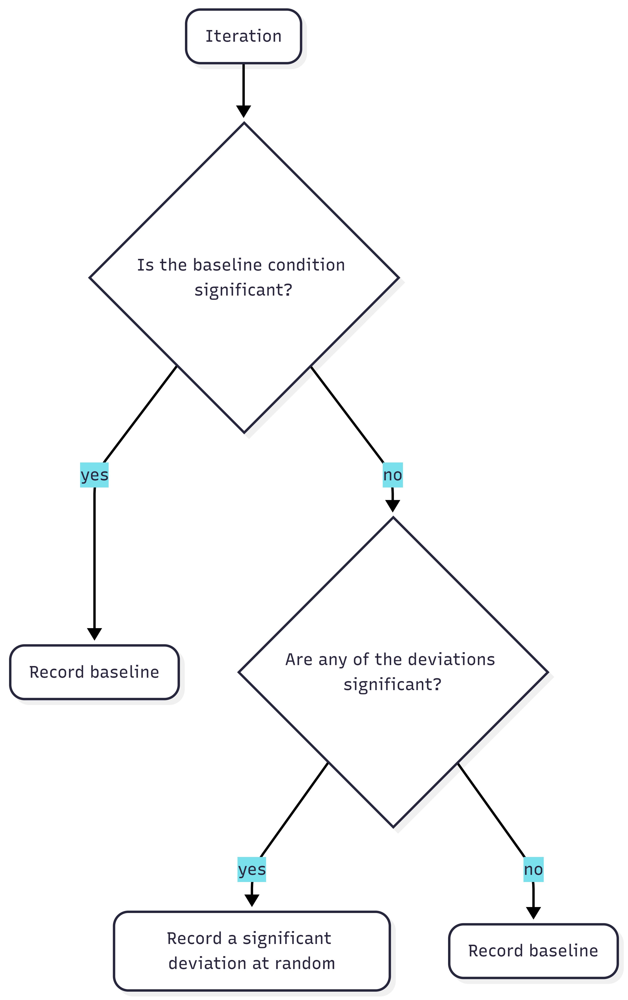
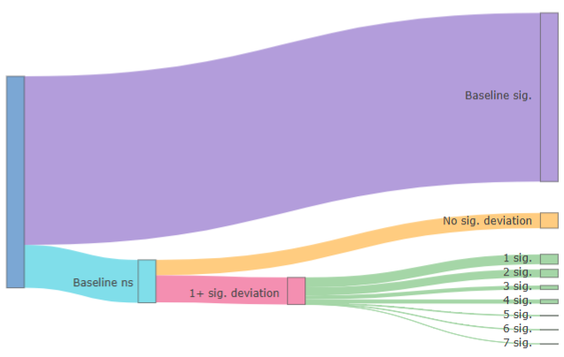
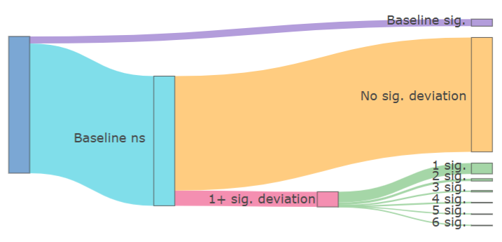

```{r}
#| label: Packages
#| echo: false
#| warning: false
#| message: false

library(tidyr)
library(ggplot2)
library(DiagrammeR)
library(dplyr)
library(thepack)
library(scales)
library(knitr)
library(kableExtra)
library(plotly)
```

The inability to reliably reproduce findings in the field of psychology is a known problem. The @opensciencecollaboration2015 found that out of 100 published studies, only 36% of significant results were replicable. One possible reason for this "replication crisis" is the exploitation of "researcher degrees of freedom" [@simmons2011]. This term describes the flexibility that researchers have in decisions made during their work. Including decisions such as how many observations to collect, which statistical model to use, and which covariates to add. When these decisions are made during data collection or analysis, researchers can make opportunistic choices which steer their results towards desired outcomes. Such opportunistic choices are called *p*-hacking and can dramatically increase false-positive rates [@stefan2023].

Preregistration was proposed as a way to limit *p*-hacking and other opportunistic researcher choices. A preregistration is a document in which decisions concerning data collection and analysis are recorded. Templates are available online to inform researchers about what information is important to preregister. The preregistration is then uploaded to a public repository, with a time stamp of when it was made public. Peer reviewers, and others, often have access to the preregistration and can evaluate it before the start of the study or compare it to the final research paper. Preregistration increases transparency about research choices and has become more popular, with the number of preregistrations increasing annually [@ferguson2023; @lindsay2018]. 

In theory, preregistration should lead to more replicable findings if researchers preregister a detailed study protocol and follow it closely.
In practice, preregistrations are often imprecise and incomplete, making them less effective at restricting researcher degrees of freedom. 
Another common problem are deviations from preregistrations [@vandenakker2024; @claesen2021]. 
Deviating means that the preregistered plan is not being followed during the execution of the study. 
@claesen2021 found deviations in as much as 93% of preregistered papers.
Often times, it can be difficult to prevent deviations, especially when very specific research protocols were preregistered. Forces outside of the researcher's control might necessitate deviations from the original plan.
However, deviations are often not reported transparently, with up to 89% being incompletely reported [@claesen2021; @willroth2024]. 
Deviations occur most commonly in data collection procedures, statistical models and exclusion criteria [@vandenakker2024]. These deviations could serve to further diminish the effectiveness of preregistrations, as it reintroduces flexibility in researcher choices.
Perhaps this is why no difference has been found between preregistered and non-preregistered papers in the number of significant findings [@vandenakker2024a], and no reduction in *p*-hacking [@brodeur2024].


## Are All Deviations Bad?

Deviations carry a negative connotation [SOURCE] but empirical evidence of their harm is still missing.
Do changes from original research plans reduce research quality? 
@lakens2024 argued not necessarily. He theorized that deviations can either positively or negatively impact research quality, depending on the type and reason for deviating.
If deviations occur due to assumptions being violated or data no longer being suitable for the planned analysis, then deviating from the original research plan can have positive effects on the validity of a test. 
Similarly, testing a hypothesis in multiple ways can improve the robustness of a study [@neumayer2007]. Meaning that adding unplanned analyses can increase confidence in the results. 
On the other hand, changing the way a hypothesis is tested can also mean that a hypothesis was given less opportunity to be falsified, which can result in a higher number of false positives. 
Consequently, whether a deviation is bad or not cannot be stated without knowing the type of deviation and the reason behind it.

Researchers themselves deem deviations to be problematic to varying degrees [@willroth2024]. 
Changes to analyses and hypotheses are considered the least acceptable, whereas changing research platforms or software are deemed relatively justifiable. 
To reach these conclusions, researchers also took into account the estimated impact on the results and whether deviations are reported transparently. 
In sum, even though deviations from preregistration are common, a clear conclusion on their effects is still missing.

## The Current Project

With this simulation study, I intend to close that gap in the literature and explore the effects of typical preregistration deviations on research outcomes and the quality of published results. Specifically, I aim to answer the question: ‘How do deviations from preregistrations affect type I and type II error rates?’ The effect of deviations is studied in three domains: Sample Size, Outlier Exclusion Criteria, and the Statistical Model. Different deviations are simulated in each domain and compared to nominal levels, which are represented by a baseline condition without deviations. This research question is investigated in the context of social science and uses a linear regression as the model of interest. The effects are examined across two scenarios: a no-effect scenario, and an effect scenario, in which the main effect parameter is changed.

As a secondary research question, I address the issue of reasons for deviation being unknown. Specifically: "What is the effect of deviating opportunistically on the type I and type II error rates?" The reason behind a deviation is important for assessing its effect. A researcher being forced to deviate due to circumstance is very different from a researcher *choosing* to deviate. When a researcher chooses to deviate, this could be because they are picking the results they prefer. For the second research question, an 'opportunistic' condition is created in which outcomes are selectively chosen from either the baseline or the deviation conditions, based on which condition has a significant *p*-value. This is done in order to proxy the opportunistic selection of results by the researcher.

With these simulations I hope to shed light on the effect of deviations from preregistration on type I and type II errors, as well as the effect of picking deviations opportunistically.

# Methods

In this section the simulation conditions, data-generating mechanism and planned analyses are outlined. In order to investigate the effects of deviations from preregistration, type I and type II error are compared across different deviation conditions. These conditions fall into different domains: specific parts of the research process in which researchers can deviate.

## Deviation domains

I reviewed which deviations to investigate by (1) how common they are, (2) their potential impact and (3) their justifiability. Based on this, deviations were chosen in the following domains: Sample Size, Outlier Exclusion Criteria, and Statistical Model. Within the three chosen domains, multiple conditions were simulated and compared to a baseline condition without any deviations.

### Sample Size

Deviations in sample size are some of the most common deviations, with consistency between preregistrations and published papers being only 28% for the exact sample size [@vandenakker2024]. Changing the sample size can inflate type II error (by decreasing power) as well as the type I error [@lakens2024; @simmons2011]. Small deviations in sample size are common and often due to factors outside of the researcher's agency. Researchers also admit to stopping collection earlier or continuing collection longer after finding disappointing results [@john2012]. However, it is unknown how often this is also used as a reason to deviate from preregistrations. Based on this, the conditions in @tbl-cond were simulated within the Sample Size domain.

### Outlier Exclusion Criteria

Literature shows that over half of published papers do not adhere to their pre-specified outlier exclusion criteria [@vandenakker2024; @claesen2021]. Vague or missing criteria in preregistrations make it harder to assess deviations and leave a lot of room for interpretation and ad hoc decisions [@heirene2024]. This could potentially allow researchers to choose how to exclude outliers based on which method provides better results. Researchers themselves, however, deem outlier deviations to be relatively acceptable [@willroth2024].

@lakens2024 argues that adding additional exclusion criteria can undermine the severity of a test. This idea is corroborated by @stefan2023, who showed that the type I error increases linearly with the number of outlier detection methods used. Furthermore, 38% of researchers admit to excluding outliers only after examining their impact on the data [@john2012]. If this is also the reason why many people deviate from their preregistered outlier criteria, then these deviations are important.

The most common method for identifying outliers in the social sciences is the *z*-score [@bakker2014; @leys2013]. A minimum of three standard deviations (*SD*) from the mean is often maintained as the rule of thumb for excluding cases. Within linear regression, outliers are also often identified based on their influence, commonly using Cook’s distance. Cook's distance excludes outliers based on how much their exclusion would influence the regression coefficients. In this study, data points were excluded in the baseline condition based on a *z*-score of 3 *SD*, with deviation conditions based on a stricter *z*-score of 2 *SD* and Cook's distance (@tbl-cond).

### Statistical Model

Among all of the aforementioned domains, the least is known about why people deviate from their preregistered statistical model. "Statistical Model" is a very broad domain and includes many types of deviations. Such as changes in the dependent variable, independent variable, statistical inference criteria and the actual statistical test. In this study, "Statistical Model" refers to all of the above-mentioned types of changes, not only the statistical test and its specifications.

The broadness of the domain also means that deviations within the domain have been investigated from multiple angles. @claesen2021 found a deviation rate of 70% within the "Analysis" domain, including deviations such as examining additional effects, changing which model is tested, and performing unregistered robustness checks. The majority of these deviations went unreported. Another study reported inconsistencies in 40% of the statistical models. Deviations included the specifications of the variables, which model was tested, and how variables were used [@vandenakker2024].

As @lakens2024 argues, at times it might be necessary to alter the statistical model. This could happen when a variable has been measured at a different level than expected or a test assumption has been violated. However, changing the statistical model can also be done opportunistically. Choosing to add an extra dependent variable because results are not yet satisfying can increase the type I error rate to 9.5%, and the addition of a covariate can increase it to 11.7% [@simmons2011]. The reasoning behind the change thus becomes very important. Therefore, failing to properly specify how variables would be operationalized in the preregistration is seen as a larger shortcoming than model deviations due to unforeseen consequences [@willroth2024]. Within the Statistical Model, three deviation conditions were simulated: adding a continuous covariate, adding a dichotomous covariate, and switching outcomes (@tbl-cond).

<!-- reasons to compare only nested models perhaps to maintain same estimands and performance measures  -->

+--------------------------------------+----------------------+-----------------------+
| Domain                               | Baseline Condition   | Deviations Conditions |
+======================================+======================+=======================+
| Sample Size                          | 200                  | +5                    |
+--------------------------------------+----------------------+-----------------------+
|                                      |                      | +30                   |
+--------------------------------------+----------------------+-----------------------+
|                                      |                      | -5                    |
+--------------------------------------+----------------------+-----------------------+
|                                      |                      | -30                   |
+--------------------------------------+----------------------+-----------------------+
| Outlier Exclusion Criteria           | *Z*-scores of 3 *SD* | *Z*-scores of 2 *SD*  |
+--------------------------------------+----------------------+-----------------------+
|                                      |                      | Cook's distance of 1  |
+--------------------------------------+----------------------+-----------------------+
| Statistical Model: covariates        | No covariates        | Continuous covariate  |
|                                      |                      |                       |
|                                      |                      | Dichotomous covariate |
+--------------------------------------+----------------------+-----------------------+
| Statistical Model: outcome switching | Y                    | Ya                    |
+--------------------------------------+----------------------+-----------------------+

: Parameter Values for Baseline Condition and Deviation Conditions per Domain {#tbl-cond}

*Note.* Variable Ya is defined in the next section. *SD* refers to standard deviation.

## Data-generating Mechanism

Data was generated under two scenarios: "X has an effect on Y" and "X has no effect on Y". The only difference in data generation between the two scenarios is in the main effect parameter, $\beta_1$. In the effect scenario, $\beta_1$ is 0.2, and in the no-effect scenario, $\beta_1$ is 0. In the baseline condition, the statistical model was defined as $$
Y = \beta_0 + \beta_1X + \epsilon,
$$ {#eq-regr} where $Y$ is the dependent variable, $\beta_0$ the intercept, $\beta_1$ the main effect, $X$ the independent variable, and $\epsilon$ the random error.

The population parameter values are presented in @tbl-DGM, together with the parameter values for the deviation conditions. The complete data-generating model is defined as

$$
\begin{aligned}
Y &=  \beta_0 + \beta_1X + \beta_2Z + \beta_3D + \epsilon,\\
Y_a &\sim Y, \quad \rho(Y, Y_a) = 0.6, 
\end{aligned}
$$ {#eq-fullreg}

where $Z$ and $D$ represent a continuous and categorical covariate respectively and $Y_a$ represents an alternative outcome variable with a medium to high correlation of 0.6 with variable $Y$.

As mentioned, data is generated under two scenarios: an effect scenario and a no-effect scenario. The only difference in data generation between the two scenarios is in the main effect parameter, $\beta_1$.

In order to assess differences between outlier exclusion criteria, the data needs to include outliers. These are simulated by generating 5% of the data, 2.5% at each end of the distribution, with -3 and 3 as mean values for the standard normal distribution from which $\epsilon$ is drawn.

+----------------------------------------------+--------------------------------------------+
| Parameter                                    | Value                                      |
+==============================================+============================================+
| Intercept                                    | $\beta_0 = 0$                              |
+----------------------------------------------+--------------------------------------------+
| Regression coefficient                       | $\beta_1 = 0$ or $\beta_1 = 0.20$          |
+----------------------------------------------+--------------------------------------------+
| Independent variable                         | $X \sim \mathcal{N}(0, 1)$                 |
+----------------------------------------------+--------------------------------------------+
| Random error                                 | $95\% = \epsilon \sim \mathcal{N}(0, 1)$   |
+----------------------------------------------+--------------------------------------------+
|                                              | $2.5\% = \epsilon \sim \mathcal{N}(-3, 1)$ |
+----------------------------------------------+--------------------------------------------+
|                                              | $2.5\% = \epsilon \sim \mathcal{N}(3, 1)$  |
+----------------------------------------------+--------------------------------------------+
| Continuous covariate regression coefficient  | $\beta_2 = 0.06$                           |
+----------------------------------------------+--------------------------------------------+
| Continuous demographic variable              | $Z \sim \mathcal{N}(0, 1)$                 |
+----------------------------------------------+--------------------------------------------+
| Dichotomous covariate regression coefficient | $\beta_3 = 0.06$                           |
+----------------------------------------------+--------------------------------------------+
| Dichotomous demographic variable             | $D \sim \text{Bernoulli}(0.5)$             |
+----------------------------------------------+--------------------------------------------+
| Sample Size                                  | $200$                                      |
+----------------------------------------------+--------------------------------------------+

: Parameter Values for the Data-Generating Mechanism {#tbl-DGM}

## Estimands

The estimand of this study is $\beta_1,$ which represents the effect of the independent variable $X$ on dependent variable $Y$. The coefficient is estimated using the `stats` package in `R` [@rcoreteam2024], under the baseline and deviation conditions.

## Outcomes

As previously mentioned, there are two scenarios under which data is generated: a no-effect scenario and an effect scenario. Within these scenarios, each simulated data set is examined under different conditions. The conditions include a baseline condition, with no deviations, and one condition for each possible deviation (@tbl-cond).

To answer the main research question, the type I and type II error rates were compared between the nominal level, represented by the baseline condition, and each deviation condition. In each repetition, the $\beta_1$ regression coefficient, the p-value and the confidence interval were recorded for each condition. All ten conditions, one baseline and nine deviation conditions, were generated for both the effect and the no-effect scenario.

To answer the second research question, the effect of deviating opportunistically was examined. This was done by creating an "Opportunistic condition", using the same data set as for the first research question. For each repetition, the *p-*value of the baseline condition was assessed. When it was significant, the baseline condition was recorded for that repetition. If it was non-significant, the deviation conditions of that repetition were checked (@fig-opp). If any of the deviation conditions were significant, one was chosen at random and recorded for that repetition. As a result, for each repetition, a significant result was be recorded if it was available among any of the conditions. This provided an 'optimized' data set, with the maximum number of significant results possible. The error rates were then compared between the baseline condition and the opportunistic condition.

```{r}
#| label: fig-opp
#| fig-cap: Workflow for Each Repetition in the Opportunistic Condition
#| echo: false
#| out-width: "80%"



```


## Performance Measures

Performance was assessed through the type I and type II error rates for the estimand $\beta_1$. Specifically, the regression coefficient itself, the *p*-value and the confidence interval were recorded for each condition in each repetition.

Type I error refers to a false-positive, or rejecting the null-hypothesis when it is true. In this study that meant detecting an effect in the no-effect scenario. Type I error is generally acceptable at a rate of 5% or below, based on an alpha level of .05. In this case, a rate of higher than 5% was considered an inflated type I error rate.

Type II error refers to a false negative, or failing to reject the null-hypothesis when it is false. In this study that meant failing to detect an effect in the effect scenario. Type II error is commonly assessed in the form of power. Power is $1-\beta$, where $\beta$ is the type II error. The nominal type II error rate of 20% results in a generally accepted power of 80%. In this study, type II error was expressed in the form of power and consequently, power below 80% was considered deflated power.

### Precision

The reliability of the performance measures was assessed using precision based on the Monte-Carlo standard error (MCSE). The desired precision for power was 1%. With an MCSE of 1%, power rates were assessed at a precision interval of [79, 81] around the nominal power of 80%. This means that values within this interval did not show strong enough evidence of an effect and might have been caused by simulation noise. Power levels outside of this interval could be stated to have increased or deflated power. 

The number of iterations was calculated using the desired precision of the project. According to @morris2019a, the required number of iterations to achieve the desired MCSE of 1% for power is 1600 (@eq-mcsepower). 

For the type I error, 1600 iterations results in an MCSE of 0.545% (@eq-mcsetypeI). This means that type I error was assessed with a precision interval of [4.455, 5.545] around the nominal $\alpha$ level of 5%. Values within this interval can be due to simulation noise. Any type I error rate outside of this interval was considered a deflated or inflated type I error rate.


:::{}
$$
\begin{aligned}
MCSE &= \sqrt{\frac{\widehat{\text{Power}}\left(1-\widehat{\text{Power}}\right)}{n_{\text{sim}}}},\\
0.01 &= \sqrt{\frac{\widehat{\text{0.8}}\left(1-\widehat{\text{0.8}}\right)}{n_{\text{sim}}}}, \\
n_\text{sim} &= \frac{0.8 \times 0.2}{(0.01)^2},\\
n_\text{sim} &= 1600
\end{aligned}
$$ {#eq-mcsepower}

:::

:::{}

$$
\begin{aligned}
MCSE &= \sqrt{\frac{\widehat{\text{Type I error}}\left(1-\widehat{\text{Type I error}}\right)}{n_{\text{sim}}}},\\
MCSE &= \sqrt{\frac{\widehat{\text{0.05}}\left(1-\widehat{\text{0.05}}\right)}{1600}}, \\
MCSE &= \sqrt{0.0000296875},\\
MCSE &\approx 0.00545
\end{aligned}
$$ {#eq-mcsetypeI}

:::


## Disclosures

### Preregistration, Reproducibility and Ethics

This project was preregistered on the 31th of March, 2026. The preregistration can be found at <https://osf.io/y5v8w/overview>. During the course of this study, I deviated in two ways. A robustness check was added after unexpected results for research question one. The robustness check was performed by increasing the number of repetitions from 1600 to 10.000. Secondly, vagueness in the preregistration was clarified. In the preregistration it was stated that the deviation would be compared to the baseline condition. In the final product the comparison is made with the nominal type I error and power. For further elaboration on my preregistration deviations please consult Appendix A. 

An `R` package was created for this project under the name `thepack` in which all functions necessary to simulate the data can be found. The package is publicly available on [GitHub](https://github.com/AJV304/thepack). In order to advance reproducibility, all other files related to this project are publicly available on [GitHub](https://github.com/AJV304/Thesis). This includes data, code scripts and output files. I made use of `renv` to create a reproducible environment in which package versions and R version were recorded. Instructions on how to reproduce the findings can be found in the README file on GitHub.

Ethics approval was obtained on October 7th, 2025 from Utrecht University, faculty of Social Sciences, under case-number #25-1980.

# Results

```{r}
#| label: Generating the data
#| echo: false
#source("../Scripts/01_datageneration/datageneration.R")

#read in saved data
df <- readRDS("../results.rds")

#The no-effect scenario
rq1.no <- df %>% filter(scenario == "no effect")
rq2.no <- choice(rq1.no)

#The effect scenario
rq1.yes <- df %>% filter(scenario == "effect")
rq2.yes <- choice(rq1.yes)

```

## Research Question One

The primary research aim of this study was to examine the effects of deviations from preregistration on type I and type II errors. In this section the type I error and power of each deviation condition are compared to the nominal levels, represented by the baseline condition. The MCSE for 1600 repetitions resulted in a precision interval of \[4.455, 5.545\] around the nominal type I error of 5% and an interval of \[79, 81\] around the nominal 80% power. Values outside of these intervals are considered inflated or deflated. @fig-rq1.y and @fig-rq1.n show the type I error and power for each condition along with the precision interval.

### Effects on Power

```{r}
#| label: Research question 1, effect scenario
#| echo: false

source("../Scripts/02_results/RQ1_effect.R")
```

Power was investigated in the effect scenario. There ability to detect this effect was investigated in each deviation condition as compared to the nominal power. The baseline scenario was intended to reflect the nominal power of 80% and resulted in a power of `r (rq1.yes.plot[rq1.yes.plot$conditions == "Baseline", "n.sig.perc"]*100)` %.

Within the Sample Size domain, the effects reflected what is known from the existing literature. Increasing the sample size, increases power and decreasing the sample size decreases power [@cohen2009]. These effects were observed in the current study as well (@fig-rq1.y).

Deviations in the Outlier Exclusion Criteria domain also impacted power. When using a strict *z*-score (exclusion based on 2 *SD* instead of 3 *SD*) power increased to `r rq1.yes.plot[rq1.yes.plot$conditions == "Strict z-score", "n.sig.perc"]*100`%. This means that existing effects were detected more often than the nominal rate. When using Cook's distance instead of *z*-scores, power dropped to `r rq1.yes.plot[rq1.yes.plot$conditions == "Cook's distance", "n.sig.perc"]*100`%. This indicates that, when this method was used, it was less likely to observe an existing effect in the generated data. Cook's distance is generally considered a less conservative form of outlier exclusion because it only excludes observations based on their influence on the regression coefficient. It is therefore quite unexpected to see such a large drop in power in this condition.

In the Statistical Model domain, the continuous and dichotomous covariate conditions showed no apparent effect on power. Deflated power was observed in the alternative outcome condition. Deviating by using an alternative, correlated outcome variable resulted in a power of `r rq1.yes.plot[rq1.yes.plot$conditions == "Alternative outcome", "n.sig.perc"]*100`%.

This simulation study demonstrates that power can be affected when deviations are forced. This effect was positive or negative, depending on the type of deviation. Overall, collecting much fewer participants, using Cook's distance as outlier criterium and switching to an alternative outcome all deflated power. Power was most impacted by switching outcomes, with a steep drop off from the nominal 80% to `r rq1.yes.plot[rq1.yes.plot$conditions == "Alternative outcome", "n.sig.perc"]*100`% power. Small changes in sample size and the addition of a covariate showed no effect, whereas collecting many more participants than planned and using a *z*-score of two standard deviations showed slight increases in power.

```{r}
#| label: fig-rq1.y
#| fig-width: 8
#| fig-height: 5
#| fig-cap: "Power for Baseline and Deviation Conditions in the Effect Scenario"
#| apa-note: NoNote \ \emph{Note.}  The red line displays the nominal power of 80%. The blue shaded area represents the precision interval around the nominal power.
#| echo: false

print(plot.1y)
```

### Effects on Type I Error

```{r}
#| label: Research question 1, no-effect scenario
#| echo: false

source("../Scripts/02_results/RQ1_noeffect.R")
```

The effects on type I error were investigated in the no-effect scenario. There was no effect in the simulated data and in this section it was investigated how often effects were still found in each condition. The baseline condition for type I error was simulated to reflect the nominal type I error rate of 5% and showed a slight inflation (`r rq1.no.plot[rq1.no.plot$conditions == "Baseline", "n.sig.perc"]*100`%) that was well within the precision interval around the nominal $\alpha$ level.

Only two conditions showed results outside of the precision interval around the nominal $\alpha$ level of 5%. Small increases in sample size showed an increased type I error of `r rq1.no.plot[rq1.no.plot$conditions == "Sample size (205)", "n.sig.perc"]*100`%. Using a strict *z-*score resulted in a type I error rate of `r rq1.no.plot[rq1.no.plot$conditions == "Strict z-score", "n.sig.perc"]*100`%. All other deviation scenarios fell within the specified precision interval and therefore did not indicate any effects on the type I error (@fig-rq1.n).

The small inflation when slightly increasing the sample size was a borderline case. When evaluating the value using the preregistered precision interval, the type I error for a sample size of 205 fell slightly outside of this interval. This meant that the effects were unlikely to be due to simulation noise. If the observed type I error rate of the condition is used to calculate the precision interval around the value, instead of the nominal type I error rate, then the observed value for sample size 205 fell within the precision interval. In light of this, all other conditions were also evaluated using their observed type I error rate to determine the MCSE and corresponding precision interval. The slight increase in sample size remained the only condition in which this nullified the effect.

```{r}
#| label: fig-rq1.n
#| fig-width: 8
#| fig-height: 5
#| fig-cap: "Type I Error Rate for Baseline and Deviation Scenarios in the No-effect Scenario"
#| apa-note: NoNote \ \emph{Note.} The red line displays the nominal type I error rate of 5%. The blue shaded area represents the precision interval around the nominal type I error rate.
#| echo: false
print(plot.1n)
```

### Robustness check

The unexpected result of an inflated type I error for the small sample size increase condition prompted me to perform a robustness check on results. For this simulation study that meant increasing the number of repetitions. The number of repetitions was increased to 10.000. The results of the robustness check showed that for power the results remain unchanged. For type I, the inflations in the small sample size increase condition and strict z-score conditions, disappear. A small effect on the type I error for the alternative outcome condition does show up as the type I error increases to 5.3%. For further elaboration see Appendix B.

## Research Question Two

```{r}
#| label: Research question 2
#| echo: false

source("../Scripts/02_results/RQ2.R")
```

The second research question pertained to the effect of *choosing* to deviate when the baseline condition is non-significant. This was done by comparing an opportunistic scenario to the nominal type I error and power. In the opportunistic scenario, one condition was recorded per repetition (@fig-opp). Whenever the baseline condition was significant, it was selected. If the baseline was non-significant, a significant deviation condition was selected instead, if available, and the number of significant deviations was recorded.

As expected, a positive effect of choosing to deviate on power was observed. Conditions were selected in order to maximize the number of significant results, consequently, an increase in power was anticipated. In 1484 out of 1600 repetitions, a significant condition was observed. This resulted in a power of `r (rq2.yes.nsig.perc*100)`% in the effect scenario (@fig-rq2.Y). In the no-effect scenario, 261 out of 1600 repetitions showed a significant condition, either the baseline condition or a deviation condition (@fig-rq2.N). Yielding an inflated type I error rate of `r (rq2.no.perc*100)`%. This is a large inflation compared to the nominal level of 5% and similarly much higher than the highest type I error rate observed in a singular deviation condition. The highest type I error rate observed under research question one was `r (max(rq1.no.plot$n.sig.perc))*100`% in the `r as.character(rq1.no.plot$conditions[which.max(rq1.no.plot$n.sig.perc)])` condition.

In the effect scenario, `r round((rq2.yes %>% filter(n.sig == "NA") %>% nrow())/1600*100, 1)`% of the repetitions resulted in a significant baseline. Of the `r 1600 - rq2.yes %>% filter(n.sig == "NA") %>% nrow()` repetitions where the baseline was non-significant, `r round((rq2.yes %>% filter(n.sig == "0") %>% nrow())/321*100, 1)`% also reported no significant deviation conditions. The remaining 64% of repetitions, in which the baseline was non-significant, had at least one significant deviation, with seven significant deviation conditions at most.

::: {#fig-rq2.Y layout="[65,35]"}
```{r}
#| out-width: "90%"


```

| Label              | Count | Percentage |
|--------------------|-------|------------|
| All repetitions    | 1600  | 100%       |
| Baseline sig.      | 1279  | 79.9%      |
| Baseline ns        | 325   | 20.3%      |
| ---                | ---   | ---        |
| 1+ sig. deviation  | 205   | 12.8%      |
| No sig. deviations | 116   | 7.3%       |
| ---                | ---   | ---        |
| 1 sig.             | 75    | 4.7%       |
| 2 sig.             | 61    | 3.8%       |
| 3 sig.             | 30    | 1.9%       |
| 4 sig.             | 31    | 1.9%       |
| 5 sig.             | 4     | 0.3%       |
| 6 sig.             | 3     | 0.2%       |
| 7 sig.             | 1     | 0.1%       |

*Note.* 'Ns' denotes non-significant. 'Sig.' denotes significance.

Distribution of Significant Conditions in the Effect Scenario, Visually (Left) and Tabular (Right).
:::

In the no-effect scenario, the majority (`r round((rq2.no %>% filter(n.sig == "0") %>% nrow())/1600*100, 1)`%) of the repetitions showed a non-significant baseline as well as non-significant deviations.

Significant baseline conditions were observed `r round((rq2.no %>% filter(n.sig == "NA") %>% nrow())/1600*100, 1)`% of the time, which was in line with the nominal $\alpha$ level of 5%. However, of the repetitions in which the baseline was non-significant, 12.8% showed at least one significant deviation result. When combining the significant baseline conditions and significant deviation conditions, the type I error rate inflated to `r rq2.no.perc*100`%. This is a large increase in the number of false positives when picking an available significant result.

::: {#fig-rq2.N layout="[65,35]"}

```{r}
#| out-width: "90%"


```

| Label | Count | Percentage |
|---|---|---|
| All repetitions | 1600 | 100.0% |
| Baseline sig. | 83 | 5.2% |
| Baseline ns | 1517 | 94.8% |
| --- | --- | --- |
| 1+ sig. deviation | 178 | 11.1% |
| No sig. deviations | 1339 | 83.7% |
| --- | --- | --- |
| 1 sig. | 126 | 7.9% |
| 2 sig. | 27 | 1.7% |
| 3 sig. | 17 | 1.1% |
| 4 sig. | 5 | 0.3% |
| 5 sig. | 1 | 0.1% |
| 6 sig. | 2 | 0.1% |

*Note.* 'Ns' denotes non-significant. 'Sig.' denotes significance.

Distribution of Significant Conditions in the No-Effect Scenario, Visually (Left) and Tabular (Right).
:::


### Robustness check

Increasing the repetition size to 10.000 did not change the conclusions for research question two. The type I error rate was 15.4% in the no-effect scenario and the power was 92.3% in the effect scenario. For further elaboration see Appendix B.

# Discussion

The goal of this simulation study was to investigate the effects of deviations on research outcomes and the quality of published results. @claesen2021 and @vandenakker2024 showed that deviating from preregistration plans happens very commonly, but the consequences of doing so remained unclear. In order to investigate these effects, I identified three domains in which deviations commonly occur: Sample Size, Outlier Exclusion Criteria and the Statistical Model. Within those domains I identified nine deviation conditions (see @tbl-cond). These deviations were then examined in terms of their effects on type I and type II error as compared to the nominally accepted rates.

## The Results

In research question one the effects of deviating were investigated by comparing the type I error and power of the deviation conditions to a baseline condition representing the nominal levels (5% and 80% respectively). What was found is that type I and type II error are both affected when researchers are forced to deviate from a preregistration. Negative impacts on type I and/or type II can occur when researchers are forced to deviate by 1) strongly decreasing the sample size, 2) using Cook's distance as outlier criterium (as opposed to a *z*-score of 3 *SD*), 3) switching to an alternative outcome with a moderate to high correlation with the original outcome variable, and 4) using a stricter *z-*score as outlier criterium (2 *SD* instead of 3 *SD*).

These four types of deviations appear to be most consequential as they can either deflate power or inflate the type I error. Positive effects on power were also observed, when largely increasing the sample size and when a strict *z*-score was used to identify outliers. There were no conditions in which the type I error was positively impacted.

The type I error and power were also affected by deviating opportunistically. In research question two, the effects of choosing to deviate in order to achieve significant results were investigated by creating a condition in which significant results were opportunistically chosen whenever available in any of the conditions. Power increased to 92.7% in the effect scenario. This result is unsurprising as the condition was designed to maximize the number of significant results. The total type I error rate for this condition was 16.3%. When the baseline scenario was non-significant, a significant deviation result was still found 12.8% of the time in the no-effect scenario.

## Implications

Two questions remain unanswered: 1) Are all deviations bad? And 2) what does this say about the existing literature?

### Are all deviations bad?

Deviating is not inherently bad. The results from the first research question show that deviating can have negative or positive effects, depending on the deviation and whether there is an effect to be detected. In reality, researchers are not aware of whether they are facing an effect or no-effect scenario. This means that they are better off avoiding deviations when possible, to minimize the risk of negative effects. However, avoiding deviations is not always possible. Sometimes deviations occur due to force majeure and are by definition outside of the researcher's control [@lakens2024]. In some cases these uncontrollable deviations might serve to improve the reliability of results. For example, if the assumptions of the preregistered test were violated and the researcher switched to an alternative analysis.

A clearer conclusion on the harm of deviating can be drawn when the reasoning behind the deviation is taken into account. The results of deviating opportunistically showed that choosing to deviate in order to find significant results can drastically increase the chances of finding false positives. When researchers choose to deviate because their preregistered results were non-significant, it is always bad. Yes, power can increase when there is an effect to be detected but since a researcher is never certain which scenario they are facing, the reward of increasing power is not worth the risk of inflating type I.

### What does this say about the existing literature?

It is difficult to draw conclusions on what this means for the literature. It is known that deviating happens very commonly in preregistered research [@vandenakker2024; @claesen2021; @willroth2024]. If we are dealing with a best case scenario, then all deviations are due to factors outside of the researcher’s control and the literature is relatively unimpacted by these deviations. The type I error in preregistered papers might be slightly increased, but not alarmingly so. The only type of deviation that is cause for concern is when researchers deviated by switching to an alternative outcome. In that case, power drops significantly and as a consequence, when significant results are reported with this type of deviation they are less likely to be due to a true effect.

In a worst case scenario, all deviations stem from malicious intent and deviations were chosen opportunistically to achieve significant results. In that case, the number of false positive results among preregistered papers would be much higher than the nominal 5%. This could mean that among preregistered papers the type I error rate would be at least 16.3%. This estimate is extremely conservative (see Limitations) and therefore serves as a lower bound for the type I error.

The problem is that the reasons behind deviating remain unknown. As @claesen2021 and @willroth2024 showed, deviations occur in as much as 93% of preregistered papers, of which 89% is reported incompletely or without explanation. This means that it cannot be determined whether we are facing a best case or worst case scenario. Without information about the distribution of motivations behind deviating, the impact of deviating is hard to assess.

## Limitations

It is important to note that the data simulated in this study was based on one set of parameter values. This is likely to make the results less generalizable to other disciplines in which the currently used data structure is less common. The baseline sample size, effect size and methods are all common among social sciences but might look much different for other statistics oriented disciplines such as medicine or economics. <!-- maybe add reasoning as appendix --> It remains unknown whether the found effects would hold up under smaller and larger samples or effect sizes. Therefore, future research might explore whether these results persist under alternative data-generating mechanisms.

It might similarly be interesting to examine the effects of a wider berth of deviations. Within this study, deviations were limited to three domains and nine deviations. In reality, there are many more [@claesen2021; @vandenakker2024]. The deviations in this study were chosen because they were deemed common, impactful or disapproved of. Deviations in hypotheses were considered outside of the scope of this study, as it required a different data structure. However, deviations in hypotheses are very common and could potentially have a large impact on type I and power [@vandenakker2023]. This means that the effects in this study are likely to be an underestimate of actual deviation impacts as a clear view on the effect of hypothesis deviations (and other domains) is still missing.

Furthermore, deviating was limited to singular deviations in this study, meaning that only one deviation was made at a time, deviations were not be combined. In vivo, researchers might choose to deviate in multiple ways simultaneously. Similar to *p*-hacking, multiple deviation methods might be combined to achieve significant results. This could lead to much higher type I error rates than found in this study.

As a result of limited deviations being tested as well as the fact that these were all tested individually, the actual impact of deviations and real type I error rates in preregistered papers might be severely underestimated. Further research into this topic might explore a factorial version of this simulation study to examine these effects.

## Recommendations

Based on the results and the existing literature, I propose three recommendations for researchers dealing with deviations and preregistrations.

1.  **If you have the choice, don’t deviate.** Before conducting research, a researcher does not know whether they will be working with an effect or not. As a result, the researcher cannot predict whether their deviation will hurt their type I or type II error. For example, changing the number of standard deviations used to calculate *z*-scores was shown to positively impact power in an effect scenario yet inflate type I error in a no-effect scenario. Because the researcher does not know which scenario they are facing, the deviation is best avoided in order to prevent an inflated type I error rate in the case of a no-effect scenario. This shows that the decision to deviate should not be made because of its potentially positive effects but should be avoided when possible because of its risks.

2.  **If you have to deviate, report it and the reason for it.** Deviations are at times unavoidable, in those cases it is important that they are dealt with properly. As of yet, researchers often fail to report their reasons for deviating [@willroth2024; @claesen2021]. This is a big issue when the current results show that choosing to deviate opportunistically leads to a much larger inflation in the type I error rate than forced deviations. There has been a call to report deviations from preregistration for a while now [@heirene2024; @claesen2021; @willroth2024]. I suggest going one step further, and mandate reporting the reasons for the deviation as well. A standardized deviation template has yet to be developed. @willroth2024 and @lakens2024 have compiled overviews of the different reasons for deviating, as well as suggestions on how to interpret the possible effects of deviating. I recommend that this type of reporting becomes the standard among preregistered papers. When researchers properly document how they deviate and why they deviated, it allows readers to evaluate the possible effects of the deviations more critically. Readers can then draw their own conclusions on the validity of the results.

3.  **Never deviate after looking at your results.** What the results showed most strongly is that choosing to deviate based on non-significant results is the most harmful. I therefore recommend avoiding it at all costs. Deviation this way can greatly increase the chances of finding false positive results and greatly undermines the reliability of the findings. Ironically, in this study I do exactly that. Based on the unexpected finding that a small increase in sample size inflates the type I error, a robustness check was executed. This illustrates the fact that these recommendations are not hard laws. Looking at results and adding a robustness check, or other reliability measures, should not harm type I and type II error. The most important thing is transparency, report all results and deviations openly and honestly.

## Conclusion

Deviating from a preregistered research plan is not inherently bad. It can serve to increase or decrease the number of false positives and false negatives depending on the type of deviation and the reason for deviating. Forced deviations show negative impacts on power and type I error but are hard to prevent due to the uncontrollable nature of the deviation. Choosing to deviate in order to get better results shows a larger impact on the number of false positives and is highly problematic.

The goal of preregistration is to limit flexibility and improve the reliability of research. Although deviations from preregistration happen commonly, the negative effects are limited when this is due to unforeseen events. The lack of transparency from researchers on why they deviate is what limits the extent to which the goals of preregistering can be achieved. Therefore I recommend that researchers register the reasons for deviating from their preregistration. Because deviations are not inherently bad, but they do have the potential to be harmful.

<!-- any data on how many deviations are reported per preregistration -->

<!-- -   limitation of specific field -->

<!-- -   what does this study say about the field and what has been published till now -->

<!-- -   how do we keep the field reliable? which deviations should we try to avoid and which ones do not seem to matter much? -->

<!-- -   hypotheses so many deviations, could be concern but outside of this scope -->

<!-- seed dependency (number of iterations or increased variability due to extra randomness introduced in the tails)-->

<!-- Monte Carlo SE formulas assume normally distributed ̂θ; for non-normal ̂θ, robust SEs exist; see White and Carlin.I think this may have caused less precision in my estimates as we added the extra outliers in the tails which decreased the normality. I checked and the b1 is actually normally distributed-->

<!-- ## Conclusion -->

<!-- -larger false positive rate in published papers -->

<!-- -papers with deviations in outlier criterium more likely to be false positive -->

<!-- -because opportunistic choosing increases type I that much more than individual deviations it is more important to transparently record the reasons for deviating. -->

\

### **Transparency**

*Author Contributions*\
Anna J. Vijlbrief: Conceptualization; Methdology; Investigation; Formal Analysis; Software; Visualization; Writing - original draft; Writing - reviewing and editing\
Anne M. Scheel: Conceptualization; Supervision; Writing - reviewing and editing\
Hanne I. Oberman: Conceptualization; Supervision; Writing - reviewing and editing

\newpage

# References

# Preregistration deviations {.appendix}

\begin{table}[h]
\begin{adjustbox}{width=\paperwidth-2cm, center}
\rowcolors{2}{gray!15}{white}
\scriptsize
\begin{tabular}{|p{4cm}|p{4cm}|p{4cm}|p{6cm}|}
\hline
\multicolumn{1}{|c|}{\textbf{Preregistered}} & \multicolumn{1}{c|}{\textbf{Deviation}} & \multicolumn{1}{c|}{\textbf{Reason for deviation}} & \multicolumn{1}{c|}{\textbf{Possible effect}} \\
\hline
"The number of simulations per condition is 1600"  &  An additional analysis was added with 10.000 iterations & Borderline results in the no-effect scenario, with unexpected outcomes & This is likely to have improved the reliability of conclusions.  \\
"The baseline condition will be compared to each of the outputs from the deviation conditions"
 & Each deviation condition was compared to the nominal type I error and power levels.  & Vagueness in the preregistration & This is unlikely to have impacted results. The cut-off values for what would be considered inflated/deflated error rates were preregistered very clearly and adhered to. The deviation mainly served to clarify the purpose of the baseline condition as illustrative rather than a comparison. \\
\hline
\end{tabular}
\end{adjustbox}
\end{table}

# Robustness figures {.appendix}

```{r}
#| label: Robust, Generating the data
#| echo: false
#| eval: false

source("../Scripts/01_datageneration/datageneration_robust.R")
```

```{r}
#| label: Robust, research question 1
#| echo: false
#| eval: false

source("../Scripts/02_results/RQ1_robust.R")
```

```{r}
#| label: fig-robustY
#| fig-cap: Robust Power per Condition
#| echo: false
#| apa-note: NoNote \ \emph{Note.} The red line displays the nominal power of 80%. The blue shaded area represents the precision interval around the nominal power.
#| eval: false

print(bigplot.1y)
```

```{r}
#| label: fig-robustN
#| fig-cap: Robust Type I Error per Condition
#| echo: false
#| apa-note: NoNote \ \emph{Note.}  The red line displays the nominal power of 80%. The blue shaded area represents the precision interval around the nominal power.
#| eval: false

print(bigplot.1n)
```

```{r}
#| label: Robust, research question 2
#| echo: false
#| eval: false

source("../Scripts/02_results/RQ2_robust.R")
```

# AI Statement {.appendix}

{height=95%}