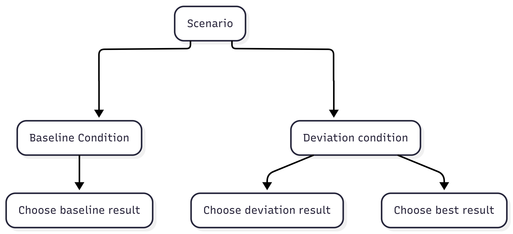

\begin{titlepage}
\centering
\vspace*{3cm}

{\Huge Busy Making Other Plans:\par}
\vspace{0.8cm}

{\Large \bfseries A Simulation Study on the Effects of Deviations from Preregistrations\par}
\vspace{1cm}

{\large A. J. Vijlbrief\par}
{\large May 11, 2026\par}

\vfill

{\large\textbf{Supervisors}\par}
A. M. Scheel\\
H. I. Oberman

\vspace{0.5cm}

{\large\textbf{Word Count}\par}
idkyet
\end{titlepage}


<!-- WHEN YOU WANT TO RUN THE CODE, REMOVE EVAL: FALSE FROM YAML -->

```{r}
#| label: Packages
#| echo: false
#| warning: false
#| message: false

library(tidyr)
library(ggplot2)
library(DiagrammeR)
library(dplyr)
library(thepack)
library(scales)
library(knitr)
library(kableExtra)
```

## Introduction

Preregistrations were popularized during the 2010s in psychology as a way to increase reproducibility [@lindsay2018]. Preregistrations are documents that are published at the start of the research process, in which decisions concerning data collection and analysis are recorded. This is done with the aim of limiting the extent to which such decisions can be influenced by results.

This practice increases transparency about research choices and has become more popular, with the number of preregistrations increasing annually [@ferguson2023; @lindsay2018]. However, whether the desired effect of reduced flexibility and increased reproducibility has been achieved is debated. Preregistration should lead to more credible and reproducible results [@wagenmakers2012; @lakens2019; @nosek2018]. However, no difference has been found between preregistered and non-preregistered papers in the number of significant findings [@vandenakker2024a], and no reduction in *p*-hacking [@brodeur2024].

There are many reasons for the uncertainty of the effect of preregistration. Preregistrations are often incomplete or overly vague about their decisions [@heirene2024; @claesen2021]. Researchers also deviate from their predetermined choices [@vandenakker2024; @claesen2021]. Deviations have been found in as many as 93% of preregistered papers, with up to 89% being incompletely reported [@claesen2021; @willroth2024]. These high deviation rates could be the reason why we see no reduction in significant findings and *p*-hacking.

The aim of this project is to identify potentially problematic deviations and investigate their effects. I first discuss the goals and problems of preregistration and the potential impact of deviations in more detail. Then, through a simulation study, I examine the effect of said deviations on type I and type II error rates.

### The Problem and the Solution

The inability to reliably reproduce findings in the field of psychology is a known problem. The @opensciencecollaboration2015 found that only 36% of significant results were reproducible. One reason for this "replication crisis" is "researcher degrees of freedom" [@simmons2011]. This term describes the flexibility that researchers have in decisions made during their work. This includes decisions such as how many observations to collect, which statistical model to use and which covariates to add. When these decisions are made during data collection or analysis, researchers can make opportunistic choices which steer their results towards desired outcomes. Such opportunistic choices are called *p*-hacking and can dramatically increase false-positive rates [@stefan2023].

The preregistration is proposed as a way to limit these types of practices. Templates are available to researchers, to inform them about what information is important to preregister. The preregistration is then uploaded to a public repository, with a time stamp of when it was published. Peer reviewers, and others, have access to the preregistration and can evaluate it before the start of the study or compare it to the final research paper.

In theory preregistration works well, if researchers are specific in their preregistration and follow it closely, this should lead to better reproducible findings. In practice, preregistrations are often imprecise and incomplete, making them less effective at restricting researcher degrees of freedom. Another common problem are deviations from preregistration [@vandenakker2024; @claesen2021]. Deviating means that the preregistered plan is not being followed during the execution of the study. Deviations occur most commonly in data collection procedures, statistical models and exclusion criteria [@vandenakker2024]. This includes differences in the total sample size, how outliers are selected and which covariates are used. These deviations could serve to further diminish the effectiveness of preregistrations, as it reintroduces researcher degrees of freedom and leaves room to revert back to *p*-hacking strategies.

### Are all deviations bad?

Deviations from preregistrations occur in all different aspects of the research process, but what is not known is the effect of these deviations. Do changes from original research plans reduce research quality? @lakens2024 theorized what the possible consequences could be. If deviations occur due to assumptions being violated or data no longer being suitable for the planned analysis, then deviating from the original research plan can have positive effects on the validity of a test. Similarly, adding additional analyses can increase the robustness. On the other hand, changes in testing also mean that a hypothesis is generally less "severely" tested. This means that a theory has not been given the proper opportunity to be falsified which can result in higher type II errors. Consequently, little can be said about whether deviations are bad, especially when the reason for the deviation is unknown.

There is no clear consensus on whether inconsistencies between preregistrations and final publications are a problem. When asked, researchers themselves deemed deviations to be problematic to varying degrees [@willroth2024]. Changes to analyses and hypotheses were considered the least acceptable, whereas changing research platforms or software were deemed relatively justifiable. The estimated impact on the results and whether the deviation was reported transparently and were also taken into consideration. To summarize, even though deviations from preregistration are common, a clear conclusion on their effects is still missing.

### The present project

With this simulation study, I intend to close this gap in the literature and explore the effects of typical preregistration deviations on research outcomes and the quality of published results. Specifically, I aim to answer the question: ‘How do deviations from preregistrations affect type I and type II error rates?’ The effect of deviations is studied in three domains: sample size, outlier exclusion criteria, and the statistical model. Different deviations are simulated in each domain and compared to a baseline condition without deviations. This research question is investigated in the context of behavioral psychology and uses a linear regression as the model of interest. The effects are examined across two scenarios: a no-effect scenario, and an effect scenario, in which the main effect parameter is changed. The aim of this study is descriptive and therefore no specific hypotheses are formulated.

As a secondary research question, I address the issue of reasons for deviations being unknown. The reason behind a deviation is important for assessing its effect. A researcher being forced to deviate due to circumstance is very different from a researcher *choosing* to deviate. When a researcher chooses to deviate, this could be because they are picking the results they prefer. Initially, the deviation conditions are simulated and the outcomes are used to assess type I and type II error as compared to the baseline condition. For the second research question, an 'opportunistic' condition is created in which outcomes are selectively chosen from either the baseline or the deviation conditions, based on which condition has a significant *p*-value. This is done in order to proxy the opportunistic selection of results by the researcher.

With these simulations I hope to shed light on the effect of deviations from preregistration on type I and type II errors, as well as the effect of picking deviations opportunistically.

## Methods

### Conditions

I reviewed which deviations to investigate by (1) how common they are, (2) their potential impact and (3) their justifiability. Based on this, deviations were chosen in the following domains: sample size, outlier exclusion criteria, and statistical model. Within the three chosen domains, multiple conditions were simulated and compared to a baseline condition without any deviations.

#### Sample size

Deviations in the sample size are some of the most common deviations, with consistency between preregistrations and published papers only being 28% for the exact sample size [@vandenakker2024]. Changing the sample size can inflate type II error (by decreasing power) as well as the type I error [@lakens2024; @simmons2011]. Small deviations in sample size are common and often due to factors outside of the researcher's agency. Researchers also admit to stopping collection earlier or continuing collection longer after finding disappointing results [@john2012]. However, it is unknown how often this is also used as a reason to deviate from preregistrations. Based on this, the conditions in @tbl-cond are simulated within the sample size domain.

#### Outlier exclusion criteria

Literature shows that over half of published papers do not adhere to their pre-specified outlier exclusion criteria [@vandenakker2024; @claesen2021]. Vague or missing criteria in preregistrations make it harder to assess deviations and leave a lot of room for interpretation and ad hoc decisions [@heirene2024]. This could potentially lead researchers to choose how to exclude outliers based on which method provides better results. Researchers themselves, however, deem outlier deviations to be relatively acceptable [@willroth2024].

@lakens2024 argues that adding additional exclusion criteria can undermine the severity of a test. This idea is corroborated by @stefan2023, who showed that the type I error increases linearly with the number of outlier detection methods used. Furthermore, 38% of researchers admit to excluding outliers only after examining their impact on the data [@john2012]. If this is also the reason why many people deviate from their preregistered outlier criteria, then these deviations are important.

The most common method for identifying outliers in the social sciences is the *z*-score [@bakker2014; @leys2013]. A minimum of three standard deviations from the mean is often maintained as the rule of thumb for excluding cases. Within linear regression, outliers are also often identified based on their influence, commonly using Cook’s distance. Cook's distance excludes outliers based on how much their exclusion would influence the regression coefficients. In this study, the baseline condition will be to exclude datapoints based on a *z*-score of 3 standard deviations from the mean, with deviation conditions based on a stricter *z*-score and Cook's distance (@tbl-cond).

#### Statistical model

Amongst all of the aforementioned domains, the least is known about why people deviate from their preregistered statistical model. "Statistical model" is a very broad domain and includes many types of deviations, such as changes in the dependent variable, independent variable, statistical inference criteria and the actual statistical test. In this paper, "statistical model" refers to the above-mentioned types of changes, not only the statistical test and its specifications.

The broadness of the domain also means that deviations within the domain have been investigated from multiple angles. @claesen2021 found a deviation rate of 70% within the "analysis" domain, including deviations like examining additional effects, changing which model is tested and performing unregistered robustness checks. The majority of these deviations went unreported. Another study reported inconsistencies in 40% of the statistical models, deviations included the specifications of the variables, which model was tested and how variables were used [@vandenakker2024].

As @lakens2024 argues, at times it might be necessary to alter the statistical model. This could happen when a variable has been measured at a different level than expected or a test assumption has been violated. However, changing the statistical model can also be done opportunistically. Choosing to add an extra dependent variable because results are not yet satisfying can increase the type I error rate to 9.5%, and the addition of a covariate can increase it to 11.7% [@simmons2011]. The reasoning behind the change thus becomes very important. Therefore, deviations due to failing to properly specify how variables would be operationalized in the preregistration are also seen as a larger shortcoming than model deviations due to unforeseen consequences [@willroth2024]. Within the statistical model, three deviation conditions are simulated: outcome switching, adding a continuous covariate, and adding a dichotomous covariate (@tbl-cond).

<!-- reasons to compare only nested models perhaps to maintain same estimands and performance measures  -->


+------------------------------------------+----------------------+------------------------------------+
| Domain                                   | Baseline condition   | Deviations conditions              |
+==========================================+======================+====================================+
| Sample size                              | 200                  | +5                                 |
+------------------------------------------+----------------------+------------------------------------+
|                                          |                      | +30                                |
+------------------------------------------+----------------------+------------------------------------+
|                                          |                      | -5                                 |
+------------------------------------------+----------------------+------------------------------------+
|                                          |                      | -30                                |
+------------------------------------------+----------------------+------------------------------------+
| Outlier exclusion criteria               | *Z*-scores of 3 SD | *Z*-scores of 2 SD      |
+------------------------------------------+----------------------+------------------------------------+
|                                          |                      | Cook's distance of 1 |
+------------------------------------------+----------------------+------------------------------------+
| Statistical methods: covariates        | No covariates        | Continuous covariate               |
|                                          |                      |                                    |
|                                          |                      | Dichotomous covariate              |
+------------------------------------------+----------------------+------------------------------------+
| Statistical methods: outcome switching | Y                    | Ya                                 |
+------------------------------------------+----------------------+------------------------------------+

: Parameter Values for Baseline Condition and Deviation Conditions per Domain {#tbl-cond}
*Note.* Variable Ya is defined in the next section.


### Data-generating mechanism

Data is generated under two scenarios: "X has an effect on Y" and "X has no effect on Y". The only difference in data generation between the two scenarios is in the main effect parameter, $\beta_1$. In the effect scenario, $\beta_1$ is 0.2, and in the no-effect scenario, $\beta_1$ is 0. In the baseline condition, the statistical model is defined as $$
Y = \beta_0 + \beta_1X + \epsilon,
$$ where $Y$ is the dependent variable, $\beta_0$ the intercept, $\beta_1$ the main effect, and $\epsilon$ the random error.

The population parameter values are presented in @tbl-DGM, together with the parameter values for the deviation conditions. The complete data-generating model is defined as

$$
\begin{aligned}
Y &=  \beta_0 + \beta_1X + \beta_2Z + \beta_3D + \epsilon,\\
Y_a &\sim Y, \quad \rho(Y, Y_a) = 0.6, 
\end{aligned}
$$

where $Z$ and $D$ represent a continuous and categorical covariate respectively and $Y_a$ represents an alternative outcome variable with a correlation of 0.6 with variable $Y$.

As mentioned, data is generated under two scenarios: an effect scenario and a no-effect scenario. The only difference in data generation between the two scenarios is in the main effect parameter, $\beta_1$. 

In order to assess differences between outlier exclusion criteria, the data needs to include outliers. These are simulated by generating 5% of the data, 2.5% at each end of the distribution, with -3 and 3 as mean values for the normal distribution from which $\epsilon$ is drawn.

+----------------------------------------------+-----------------------------------------------+
| Parameter                                    | Value                                         |
+==============================================+===============================================+
| Intercept                                    | $\beta_0 = 0$                                 |
+----------------------------------------------+-----------------------------------------------+
| Regression coefficient                       | $\beta_1 = 0$ or $\beta_1 = 0.20$             |
+----------------------------------------------+-----------------------------------------------+
| Independent variable                         | $X \sim \mathcal{N}(\mu, \sigma^2)$           |
+----------------------------------------------+-----------------------------------------------+
| Random error                                 | $95\% = \epsilon \sim \mathcal{N}(0, 1)$      |
+----------------------------------------------+-----------------------------------------------+
|                                              | $2.5\% = \epsilon \sim \mathcal{N}(-3, 1)$ \| |
+----------------------------------------------+-----------------------------------------------+
|                                              | $2.5\% = \epsilon \sim \mathcal{N}(3, 1)$ \|  |
+----------------------------------------------+-----------------------------------------------+
| Continuous covariate regression coefficient  | $\beta_2 = 0.06$                              |
+----------------------------------------------+-----------------------------------------------+
| Continuous demographic variable              | $Z \sim \mathcal{N}(\mu, \sigma^2)$           |
+----------------------------------------------+-----------------------------------------------+
| Dichotomous covariate regression coefficient | $\beta_3 = 0.06$                              |
+----------------------------------------------+-----------------------------------------------+
| Dichotomous demographic variable             | $D \sim \text{Bernoulli}(0.5)$                |
+----------------------------------------------+-----------------------------------------------+
| Alternative outcome error                    | $\epsilon_a \sim \mathcal{N}(\mu, \sigma^2)$  |
+----------------------------------------------+-----------------------------------------------+
| Sample size                                  | $200$                                         |
+----------------------------------------------+-----------------------------------------------+

: Parameter Values for the Data generating mechanism {#tbl-DGM}

### Estimands

The estimand of this study is $\beta_1,$ which represents the effect of the independent variable $X$ on dependent variable $Y$. The coefficient is estimated using the `stats` package in `R` [@rcoreteam2024], under the baseline and deviation conditions.

### Outcomes

As previously mentioned, there are two scenarios under which data is generated: a no-effect scenario and an effect scenario. Within these scenarios, each simulated data set is examined under different conditions. The conditions include a baseline condition, with no deviations, and one condition for each possible deviation (@tbl-cond).

To answer the main research question, the type I and type II error rates are compared between the baseline result and each deviation result. All ten conditions, one baseline and nine deviation conditions, are executed using the same data set. In each repetition the $\beta_1$ regression coefficient, the p-value and the confidence interval are recorded for each condition.

To answer the second research question, the effect of deviating opportunistically is examined. This is done using the same data set as in the first section. For each repetition, the baseline *p-*value is assessed. When it is significant, the baseline condition is recorded. If it is insignificant, the deviations conditions of that repetition are checked. If any of the deviations conditions are significant, one is chosen at random and recorded for that repetition. As a result, for each repetition, a significant result will be recorded if it is available among any of the conditions. This provides an 'optimized' data set. The error rates will then be compared between the baseline results and the opportunistic result. An overview can be found in @fig-phases.

{#fig-phases}

*Note.* This figure illustrates the study phases. In phase 1, the baseline result is compared to the deviation result. In phase 2, the baseline result is compared to the best result.

### Performance measures

Performance is assessed through the type I and type II error for the estimand $\beta_1.$ Specifically, the regression coefficient itself, the *p*-value and the confidence interval are recorded for each condition in each repetition.

The type I error refers to a false-positive, or rejecting the null-hypothesis when it is true. In this study that would mean detecting an effect in the no-effect scenario. Type I error is generally acceptable at a rate of 5% or below, based on an alpha level of .05. In this case, a rate of higher than 5% is considered an inflated type I error rate.

Type II error refers to a false negative, or failing to reject the null-hypothesis when it is false. In this study that would mean failing to detect an effect in the effect scenario. Type II error is commonly assessed in the form of power. Power is $1-\beta$, where $\beta$ is the type II error. The nominal type II error rate of .20 results in a generally accepted power of 80%. In this study, type II error will be expressed in the form of power rates and consequently, power below 80% is considered deflated power.

The number of iterations is based on the desired precision of the project. A Monte-Carlo standard error (MCSE) of 0.01 is deemed appropriate. According to the formula by @morris2019a,

$$
\begin{aligned}
MCSE = \sqrt{\frac{\widehat{\text{Power}}\left(1-\widehat{\text{Power}}\right)}{n_{\text{sim}}}},\\
0.01 = \sqrt{\frac{\widehat{\text{0.8}}\left(1-\widehat{\text{0.8}}\right)}{n_{\text{sim}}}}, \\
n_\text{sim} = \frac{0.8 \times 0.2}{(0.01)^2},\\
n_\text{sim} = 1600
\end{aligned}
$$

the required number of iterations to achieve the desired MCSE is 1600.

With an MCSE of 0.01, power rates are assessed at a precision interval of \[79, 81\] around the nominal power of 80%. Power levels outside of this range can be stated to have increased or deflated power levels that are not due to simulation noise.

For the type I error, 1600 iterations results in an MCSE of 0.00545. 
$$
\begin{aligned}
MCSE = \sqrt{\frac{\widehat{\text{Type I error}}\left(1-\widehat{\text{Type I error}}\right)}{n_{\text{sim}}}},\\
MCSE = \sqrt{\frac{\widehat{\text{0.05}}\left(1-\widehat{\text{0.05}}\right)}{1600}}, \\
MCSE = \sqrt{2.96875e-05},\\
MCSE = 0.00545
\end{aligned}
$$ 
This means that type I error is assessed with a precision interval of \[0.045, 0.055\] around the nominal $\alpha$ level of 0.05. Any type I error rates outside of this interval are considered deflated or inflated.


### Preregistration, reproducibility and ethics

This project was preregistered on the 31th of March, 2026. The preregistration can be found at [link]. In order to prevent "seed hacking", I preregistered a seed which would only become available after the date of preregistration.
An R package was created for this project under the name `thepack` in which all functions necessary to simulate the data can be found. The package is publicly available at [githublink]. In order to advance reproducibility, all other files related to this project are publicly available at [github link]. This includes data, code scripts and output files. I made use of `renv` to create a reproducible environment in which package versions and R version are recorded. Instructions on how to reproduce the findings can be found in the README file on GitHub.

Ethics approval was obtained on October 7th, 2025 from the Utrecht University faculty of Social Sciences under case-number #25-1980. 


## Results

```{r}
#| label: Generating the data
#| echo: false
#source("Scripts/01_datageneration/datageneration.R")

#read in saved data
df <- readRDS("../results.rds")

#The no-effect scenario
rq1.no <- df %>% filter(scenario == "no effect")
rq2.no <- choice(rq1.no)

#The effect scenario
rq1.yes <- df %>% filter(scenario == "effect")
rq2.yes <- choice(rq1.yes)

```


### Research question one
The primary research aim of this study is to examine the effects of deviations from preregistration on type I and type II errors. In this section the type I and II errors of each deviation condition are compared to the nominal levels. @fig-rq1.y and @fig-rq1.n show the type I error and power for each condition.

#### Effects on power
```{r}
#| label: Research question 1, effect scenario
#| echo: false

source("../Scripts/02_results/RQ1_effect.R")
```

Within the Sample Size domain, the effects reflect what is known from the existing literature. Increasing the sample size, increases the power and decreasing the sample size decreases the power [sources]. These effects can be observed in the current study as well (@fig-rq1.y). 


Deviations in the Outlier Exclusion Criteria domain also impact power. When using a strict *z*-score (exclusion based on 2 *SD* (standard deviation) instead of 3 *SD*) power increases to `r rq1.yes.plot[rq1.yes.plot$conditions == "Strict z-score", "n.sig.perc"]*100`%. This means that we are able to detect existing effects more often than in the nominal condition. When using Cook's distance instead of *z*-scores, the power drops to `r rq1.yes.plot[rq1.yes.plot$conditions == "Cook's distance", "n.sig.perc"]*100`%. This indicates that, when this method is used, we are less likely to observe an existing effect in the generated data then we would in the nominal condition. Cook's distance is generally considered a less conservative form of outlier exclusion because it only excludes observations based on their influence on the regression coefficient. It is therefore quite unexpected to see such a large drop in power in this condition. 

In the Statistical Model domain, deflated power is only observed in the alternative outcome condition. Deviating by using an alternative, correlated outcome variable resulted in a power of `r rq1.yes.plot[rq1.yes.plot$conditions == "Alternative outcome", "n.sig.perc"]*100`%. Both the continuous and dichotomous covariate conditions have no apparent effect on power.

This simulation study demonstrates that power can be affected when researchers are forced to deviate from a preregistration. This effect can be positive or negative, depending on the type of deviation. Overall, collecting much fewer participants, using Cook's distance as outlier criterium and switching to an alternative outcome all deflate powers. Power is most impacted by switching outcomes, with a steep drop off from the nominal 80% to `r rq1.yes.plot[rq1.yes.plot$conditions == "Alternative outcome", "n.sig.perc"]*100`% power. Small changes in sample size and the addition of a covariate show no effect, whereas collecting many more participants than planned and using a *z*-score of two standard deviations show slight increases in power. 

```{r}
#| label: fig-rq1.y
#| fig-width: 8
#| fig-height: 5
#| fig-cap: "Power for Baseline and Deviation Conditions in the Effect scenario"
#| echo: false

print(plot.1y)
```


#### Effects on Type I error
```{r}
#| label: Research question 1, no-effect scenario
#| echo: false

source("../Scripts/02_results/RQ1_noeffect.R")
```
The Monte Carlo standard error for type I error resulted in a precision range of \[0.045, 0.055\] around the nominal $\alpha$ level of 0.05. Only two conditions show results outside of this precision range. Small increases in effect size show an increased type I error of `r rq1.no.plot[rq1.no.plot$conditions == "Sample size (205)", "n.sig.perc"]*100`%. Using a strict *z-*score results in a type I error rate of `r rq1.no.plot[rq1.no.plot$conditions == "Strict z-score", "n.sig.perc"]*100`%. All other deviation scenarios fall within the prespecified precision range and therefore do not indicate any effects on the type I error (@fig-rq1.n).

```{r}
#| label: fig-rq1.n
#| fig-width: 8
#| fig-height: 5
#| fig-cap: "Type I error rate for Baseline and Deviation scenarios in the no-effect Scenario"
#| echo: false
print(plot.1n)
```


### Research question two
```{r}
#| label: Research question 2
#| echo: false

source("../Scripts/02_results/RQ2.R")
```
The second research question pertains to the effect of *choosing* to deviate when the baseline condition is insignificant. The results fail to show a negative effect of choosing to deviate on power. The power does not deflate and is actually increased to `r (rq2.yes.nsig.perc*100)`%. In the no-effect scenario, an inflated type I error rate of `r (rq2.no.perc*100)`% is observed. This is a large inflation compared to the nominal level of 5% and similarly much higher than the highest type I error rate in a singular deviation condition `r (max(rq1.no.plot$n.sig.perc))*100`% in the `r as.character(rq1.no.plot$conditions[which.max(rq1.no.plot$n.sig.perc)])` condition).

In the effect scenario, `r rq2.yes %>% filter(n.sig == "NA") %>% nrow()` out of 1600 repetitions resulted in a significant baseline. Of the `r 1600 - rq2.yes %>% filter(n.sig == "NA") %>% nrow()` repetitions where the baseline was insignificant, `r round((rq2.yes %>% filter(n.sig == "0") %>% nrow())/321*100, 1)`% also reported no significant deviation conditions. The remaining 64% of repetitions in which the baseline was insignificant had at least one significant deviation, with seven significant deviation conditions at most.

In the no-effect scenario, the majority (`r round((rq2.no %>% filter(n.sig == "0") %>% nrow())/1600*100, 1)`%) of the repetitions showed an insignificant baseline as well as insignificant deviations (@tbl-rq2). However of the repetitions in which the baseline was insignificant, 13.3% showed at least one significant result. Neither of the scenarios contained a repetition in which all deviations were significant when the baseline was not.

```{r}
#| label: tbl-rq2
#| tbl-cap: "Distribution of the number of significant deviations"
#| echo: false
#| warning: false

kable(rq2.table,
      format    = "latex",   
      booktabs  = TRUE,
      col.names = c(" ", "Effect", "No-effect"),
      digits    = 2
) |>
  kable_styling(
    latex_options = c("hold_position"),
    font_size     = 12
  ) |>
  add_header_above(c("Significant deviation conditions" = 1, "Occurences" = 2))


```

<!-- 16.3% type I error rate. Large increase in the number of false positives when picking an available significant result. Keep in mind that this is not factorial but 'only' cherrypicking data. -->

<!-- this indicates that if people are indeed deviating because of unsatisfactory results, the false positive rate in preregistered papers is likely to be minimally 16.3%-->

## Discussion

### Forced deviation

This simulation study demonstrates that type I and type II error are both affected when researchers are forced to deviate from a preregistration. 

Power can be affected both positively and negatively, depending on the type of deviation and whether there is an effect to be detected. 

Only two deviation conditions showed effects on the type I error. Small increases in sample size resulted in a small inflation of type I error and using two standard deviations as outlier criterium showed a larger inflation. For all other conditions, effects on type I error were not strong enough to suggest an effect outside of simulation noise. This shows that there is little risk of inflating the type I error when being forced to deviate from a preregistration except for using a stricter *z*-score as outlier criterium. 

The small inflation when slightly increasing the sample size is a borderline case. Using the MCSE of 0.055 which was preregistered for this study means that it falls outside of the precision range, outside of which I stated that effects were unlikely to be due to simulation noise. Using the empirical MCSE of this condition however shows that the effect might still be due to noise. With a type I error of 0.055625, the empirical MCSE becomes 0.00573. This means that type I error rates higher than 0.055729 would be considered inflated, which this condition just remains beneath. When theoretically considering this effect, it is more likely that this effect is in fact due to simulation error rather than an actual effect. If this was an effect of the deviation, it would be expected to see an opposite effect when decreasing the sample size slightly as well as a stronger effect when increasing the sample size more extremely. Neither of these consequences can be observed in the other sample size conditions, thus making it more likely that the observed effect is indeed due to simulation noise. (In light of this, all other conditions were also evaluated using the empirical MCSE. The slight increase in sample size remained the only condition in which this changed the conclusion.)

From these results we can conclude that negative impacts on type I and/or type II can occur when researchers are forced to deviate by 1) strongly decreasing the sample size, 2) using Cook's distance as outlier criterium, 3) switching to an alternative outcome, and 4) using a stricter *z-*score as outlier criterium. Before conducting research, the researcher does not know whether they will be working with an effect or not. As a result, the researcher cannot predict whether their deviation will hurt their type I or type II error. Deviating in the number of standard deviations used to calculate z-scores can positively impact power in an effect scenario yet inflate type I error in a no-effect scenario. Consequently, the four types of deviations previously mentioned are deemed most harmful. 

### Opportunistic deviation

The results also showed an effect of deviating opportunistically on the type I error rate but failed to provide evidence for a negative effect of choosing to deviate on the power. The type I error rate of `r (rq2.no.perc*100)`% indicates that when researchers choose to make alterations to their methodology when they find non-significant results, their risk of reporting false positives becomes much higher. The types of deviations investigated in this simulation are based on deviations that are commonly reported. This means that even in preregistered papers, type I error rates might be much higher than the aspired 5%. As of yet, researchers often fail to report their reasoning behind deviating [source]. This becomes a much bigger issue when the results show that choosing to deviate opportunistically leads to a much larger inflation in the type I error rate than forced deviations. 
Opportunistic deviation was limited to singular deviations in this research. This suggests that 
<!-- any data on how many deviations are reported per preregistration -->

### Limitations

<!-- -   limitation of specific field -->
A limitation of this study is the fact that the data was simulated based on common structures and numbers found in the social sciences. This is likely to make the results less generalizable to other disciplines. The baseline sample size, effect size and methods investigated are all common among social sciences but might look much different for other statistics oriented disciplines such as medicine. It remains unknown whether the found effects would remain under smaller and larger samples or effect sizes.

<!-- -   what does this research say about the field and what has been published till now -->

<!-- -   how do we keep the field reliable? which deviations should we try to avoid and which ones do not seem to matter much? -->

<!-- -   hypotheses so many deviations, could be concern but outside of this scope -->

<!-- seed dependency (number of iterations or increased variability due to extra randomness introduced in the tails)-->

<!-- Monte Carlo SE formulas assume normally distributed ̂θ; for non-normal ̂θ, robust SEs exist; see White and Carlin.I think this may have caused less precision in my estimates as we added the extra outliers in the tails which decreased the normality. I checked and the b1 is actually normally distributed-->

## Conclusion

-larger false positive rate in published papers
-papers with deviations in outlier criterium more likely to be false positive
-because opportunistic choosing increases type I that much more than individual deviations it is more important to transparently record the reasons for deviating.

\newpage

## References
